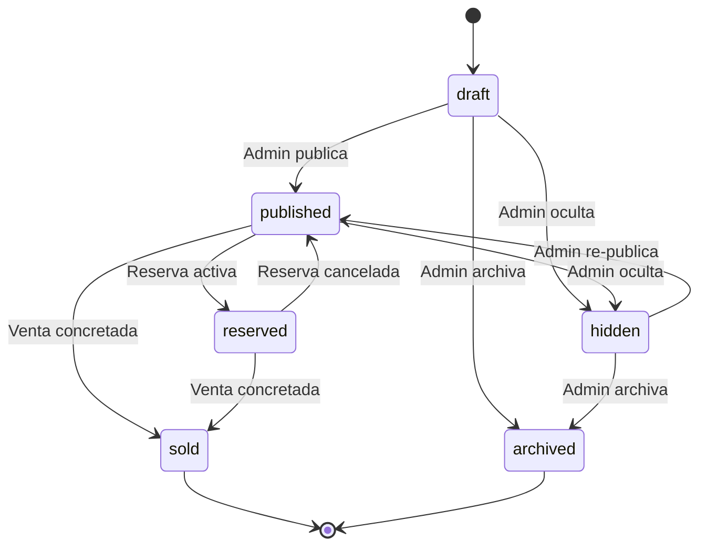
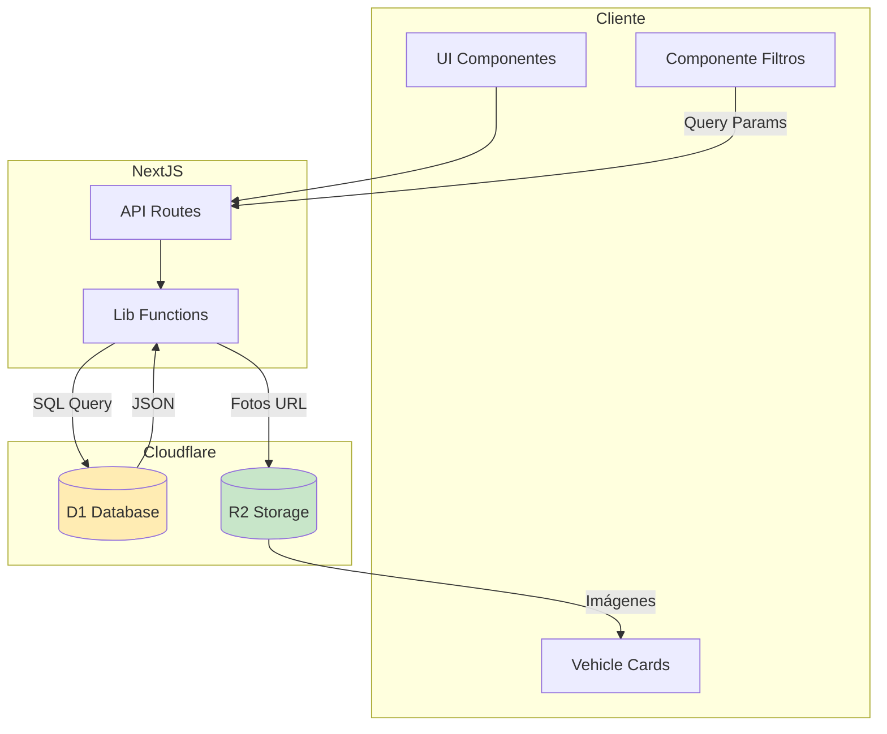

# Módulo Catálogo - Documentación Técnica y Operativa

```
Version: 1.0
Fecha: 2026-02-19
Responsable: Jeans Selfene
Relacionado con: PLAN-TRABAJO-MTG v1.x
---
Historial de cambios:
| Versión | Fecha | Responsable | Cambios |
|---------|-------|-------------|---------|
| 1.0 | 2026-02-19 | Jeans Selfene | Versión inicial |
```

---

## A) MANUAL TÉCNICO

### 1. Propósito del Módulo

El módulo de Catálogo es el componente público de la plataforma MTG que permite a los visitantes explorar el inventario de vehículos disponibles. Es la puerta de entrada principal para clientes potenciales y debe proporcionar una experiencia de navegación fluida con filtros avanzados.

**Objetivos:**
- Mostrar vehículos disponibles al público general
- Permitir filtrado por múltiples criterios (marca, modelo, año, precio, km, región)
- Optimizar para SEO con URLs amigables
- Integrar con módulos de reserva y leads

### 2. Arquitectura Interna

#### Archivos Involucrados

| Archivo | Propósito |
|---------|-----------|
| [`app/(public)/catalogo/page.tsx`](app/(public)/catalogo/page.tsx) | Página principal del catálogo |
| [`app/(public)/catalogo/catalog-content.tsx`](app/(public)/catalogo/catalog-content.tsx) | Componente de contenido del catálogo |
| [`app/api/vehicles/route.ts`](app/api/vehicles/route.ts) | API pública de vehículos |
| [`lib/api/catalog.ts`](lib/api/catalog.ts) | Lógica de negocio para catálogo |
| [`components/catalog-filters.tsx`](components/catalog-filters.tsx) | Componente de filtros |
| [`components/vehicle-card.tsx`](components/vehicle-card.tsx) | Tarjeta de vehículo en grid |
| [`hooks/use-catalog-filters.ts`](hooks/use-catalog-filters.ts) | Hook para gestión de filtros |

#### Flujo de Datos

```
Usuario -> /catalogo -> API /api/vehicles -> D1 Database
                                    |
                                    v
                            Filtros ejecutados en backend
                                    |
                                    v
                            Respuesta JSON con vehículos
```

### 3. Tablas Relacionadas (Schema + Índices)

#### Tabla: `vehicles`

```sql
CREATE TABLE vehicles (
    id TEXT PRIMARY KEY,
    slug TEXT UNIQUE NOT NULL,
    brand TEXT NOT NULL,
    model TEXT NOT NULL,
    year INTEGER NOT NULL,
    price INTEGER NOT NULL,
    mileage_km INTEGER,
    transmission TEXT CHECK(transmission IN ('manual', 'auto')),
    fuel_type TEXT,
    region TEXT,
    city TEXT,
    status TEXT DEFAULT 'draft' CHECK(status IN ('draft', 'published', 'reserved', 'sold', 'hidden', 'archived')),
    description TEXT,
    created_by TEXT REFERENCES users(id),
    created_at TEXT DEFAULT CURRENT_TIMESTAMP,
    updated_at TEXT DEFAULT CURRENT_TIMESTAMP
);
```

#### Índices Críticos

```sql
-- Índices para rendimiento del catálogo
CREATE INDEX idx_vehicles_status ON vehicles(status);           -- Filtrar por estado
CREATE INDEX idx_vehicles_created_at ON vehicles(created_at);   -- Ordenar por fecha
CREATE INDEX idx_vehicles_brand_model ON vehicles(brand, model); -- Filtros combinados
CREATE INDEX idx_vehicles_price ON vehicles(price);             -- Ordenar por precio
```

#### Tabla: `vehicle_photos`

```sql
CREATE TABLE vehicle_photos (
    id TEXT PRIMARY KEY,
    vehicle_id TEXT NOT NULL REFERENCES vehicles(id) ON DELETE CASCADE,
    url TEXT NOT NULL,
    position INTEGER DEFAULT 0,
    created_at TEXT DEFAULT CURRENT_TIMESTAMP
);

CREATE INDEX idx_vehicle_photos_vehicle_id ON vehicle_photos(vehicle_id);
```

### 4. Máquina de Estados del Vehículo

**Estados permitidos para el Catálogo:**
- `draft` - Borrador (no visible)
- `published` - Visible en catálogo público
- `hidden` - Oculto (admin lo oculta)
- `reserved` - Reservado (reserva activa)
- `sold` - Vendido
- `archived` - Archivado (historico)

**Regla de Visibilidad en Catálogo:**
> Solo vehículos con `status = 'published'` aparecen en el catálogo público.



### 5. Guards y Reglas de Negocio

#### Regla: CATALOGO_VISIBILIDAD
```typescript
// Solo publicados son visibles
const isVisible = vehicle.status === 'published';
```

#### Regla: CATALOGO_SLUG_UNICO
```typescript
// Cada vehículo debe tener slug único para SEO
const slug = generateSlug(vehicle.brand, vehicle.model, vehicle.year, vehicle.id);
```

#### Regla: CATALOGO_SIN_RESERVA_ACTIVA
```typescript
// Verificar si hay reserva activa para mostrar disponibilidad
const hasActiveReservation = await checkActiveReservation(vehicle.id);
```

### 6. Endpoints API

| Método | Endpoint | Descripción |
|--------|----------|-------------|
| GET | `/api/vehicles` | Listar vehículos publicados con filtros |
| GET | `/api/vehicles/[id]` | Obtener detalles de un vehículo |
| GET | `/api/catalogo` | Alias público para catálogo |

#### Parámetros de Filtrado

```
GET /api/vehicles?brand=mazda,toyota&year_min=2020&price_max=30000000&status=published&limit=20&offset=0
```

| Parámetro | Tipo | Descripción |
|-----------|------|-------------|
| brand | string | Marcas separadas por coma |
| model | string | Modelos separados por coma |
| year_min | number | Año mínimo |
| year_max | number | Año máximo |
| price_min | number | Precio mínimo |
| price_max | number | Precio máximo |
| region | string | Región |
| status | string | Estado del vehículo |
| limit | number | Límite de resultados (default: 20) |
| offset | number | Offset para paginación |

### 7. Dependencias

- **D1 Database**: Almacenamiento de vehículos
- **R2 Storage**: Almacenamiento de imágenes de vehículos
- **lib/api/catalog.ts**: Lógica de filtrado
- **hooks/use-catalog-filters.ts**: Estado de filtros en cliente

### 8. Riesgos Conocidos

| Riesgo | Impacto | Mitigación |
|--------|---------|-------------|
| Sin índices en filtros | Query lenta con >1000 vehículos | Índices compuestos en brand+model+price |
| Fotos no cargan | UI rota | Fallback a imagen placeholder |
| Slug duplicado | Error 500 en API | Validación única en creación |
| Cache excesivo | Datos desactualizados | TTL corto o cache con revalidación |

### 9. Reglas de Exclusión

- **NO mostrar** vehículos en estado `draft`, `hidden`, `archived`
- **NO mostrar** vehículos con reserva activa (indicar "reservado")
- **NO mostrar** vehículos vendidos (indicar "vendido")

### 10. Consideraciones de Rendimiento

1. **Paginación**: Siempre usar `limit` y `offset` (máx 50 por request)
2. **Índices compuestos**: Crear índice `(status, brand, price)` para consultas comunes
3. **Lazy loading**: Cargar fotos bajo demanda
4. **Cache**: Cachear resultados por 60 segundos en Edge

---

## B) MANUAL OPERATIVO

### 1. ¿Qué hace el Módulo?

El módulo de Catálogo permite a los visitantes del sitio web:
- Navegar por el inventario de vehículos disponibles
- Aplicar filtros para encontrar vehículos específicos
- Ver detalles completos de cada vehículo
- Acceder a acciones de reserva o contacto

### 2. Flujo Paso a Paso

#### Flujo Público (Cliente)

```
1. Usuario visita /catalogo
2. Sistema carga vehículos publicados (paginados)
3. Usuario aplica filtros (marca, modelo, año, precio)
4. Sistema filtra y muestra resultados
5. Usuario hace click en vehículo
6. Sistema muestra página de detalles /vehiculos/[id]
```

#### Flujo de Administración

```
1. Admin crea vehículo en /admin/vehiculos/nuevo
2. Admin carga fotos del vehículo
3. Admin define precio y características
4. Admin cambia estado a "published"
5. Vehículo aparece automáticamente en catálogo
```

### 3. Permisos por Rol

| Rol | Ver Catálogo | Aplicar Filtros | Ver Detalles |
|-----|--------------|-----------------|--------------|
| Visitante | ✅ | ✅ | ✅ |
| Cliente | ✅ | ✅ | ✅ |
| Sales | ✅ | ✅ | ✅ |
| Ops | ✅ | ✅ | ✅ |
| Admin | ✅ | ✅ | ✅ |

### 4. Escenarios Normales

| Escenario | Comportamiento Esperado |
|-----------|-------------------------|
| Catálogo vacío | Mostrar mensaje "No hay vehículos disponibles" |
| Filtro sin resultados | Mostrar "No se encontraron vehículos con esos filtros" |
| Vehículo con fotos | Mostrar galería con todas las fotos |
| Vehículo sin fotos | Mostrar imagen placeholder |
| many resultados | Paginación con Next/Prev |

### 5. Escenarios de Error

| Error | Causa | Solución |
|-------|-------|----------|
| 500 al cargar catálogo | Error en D1 | Revisar logs de Cloudflare |
| Fotos no cargan | R2 no configurado | Verificar bucket R2 |
| Filtros lentos | Sin índices | Ejecutar migración índices |
| Página 404 | Slug no existe | Verificar URL o crear redirect |

### 6. ¿Qué hacer si falla?

1. **Verificar estado del vehículo**: Asegurar que status = 'published'
2. **Revisar logs**: Cloudflare Dashboard > Functions > Logs
3. **Verificar R2**: Confirmar que fotos existen en bucket
4. **Testear API**: Llamar `/api/vehicles?status=published` directamente
5. **Limpiar cache**: Ejecutar purge en Cloudflare

### 7. KPIs Asociados

| KPI | Descripción | Meta |
|-----|-------------|------|
| CAT-01 | Visitas al catálogo | >1000/mes |
| CAT-02 | Tasa de clicks en vehículo | >30% |
| CAT-03 | Tiempo de carga < 3s | >95% |
| CAT-04 | Vehículos publicados | >50 activos |
| CAT-05 | Tasa de uso de filtros | >40% |

---

## C) DIAGRAMA

### Diagrama de Flujo del Catálogo

```mermaid
flowchart TD
    A[Usuario visita /catalogo] --> B{¿Hay vehículos publicados?}
    B -->|No| C[Mostrar mensaje vacío]
    B -->|Sí| D[API GET /api/vehicles]
    D --> E{Aplicar Filtros}
    E -->|Sin filtros| F[Mostrar todos]
    E -->|Con filtros| G[Ejecutar WHERE en D1]
    G --> H[Resultados filtrados]
    F --> I[Paginación]
    H --> I
    I --> J[Renderizar VehicleCard Grid]
    J --> K[Usuario hace click]
    K --> L[/vehiculos/[slug]]
    L --> M[Mostrar VehicleDetail]
    M --> N{Botón Reservar?}
    N -->|Sí| O[Modal de Reserva]
    N -->|No| P[Botón WhatsApp]
    O --> P
    
    style A fill:#e1f5fe
    style D fill:#fff3e0
    style L fill:#e8f5e9
    style O fill:#fce4ec
```

### Diagrama de Arquitectura


