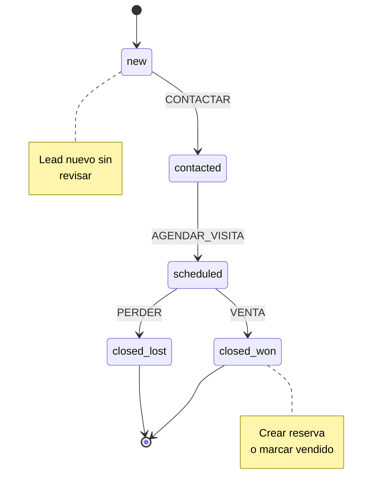
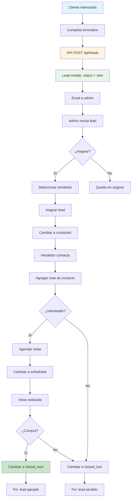
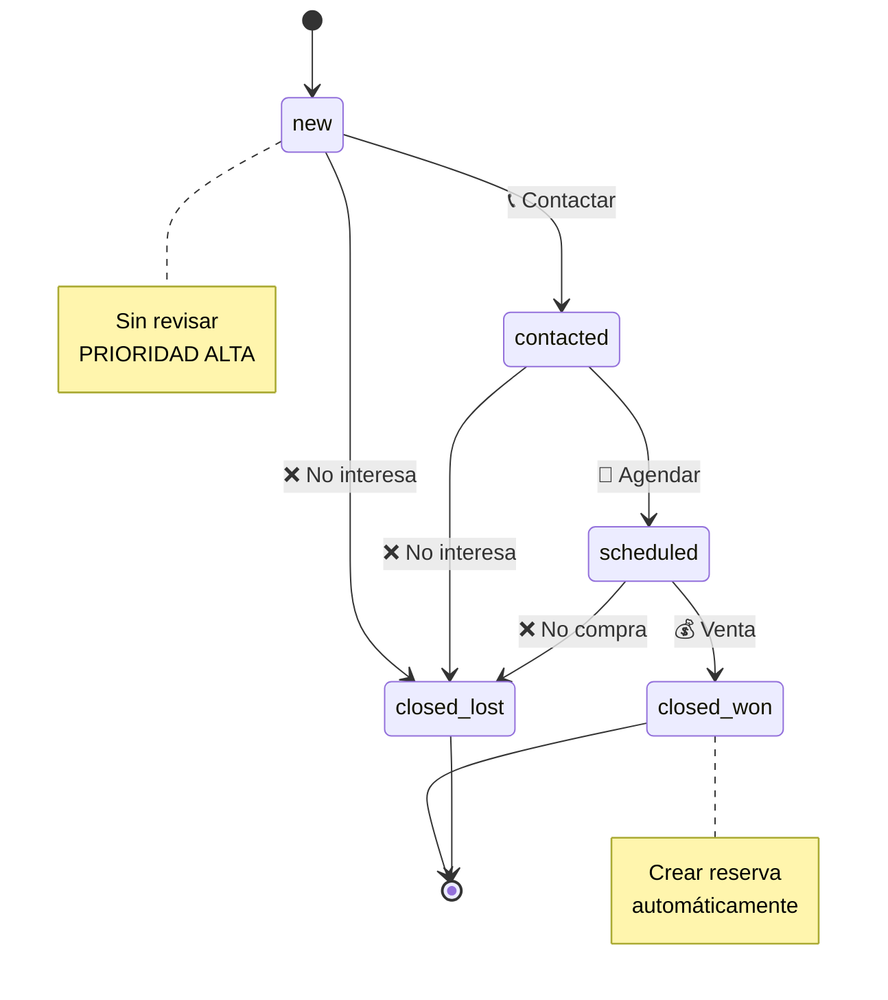

# Módulo Leads - Documentación Técnica y Operativa

```
Version: 1.0
Fecha: 2026-02-19
Responsable: Jeans Selfene
Relacionado con: PLAN-TRABAJO-MTG v1.x
---
Historial de cambios:
| Versión | Fecha | Responsable | Cambios |
|---------|-------|-------------|---------|
| 1.0 | 2026-02-19 | Jeans Selfene | Versión inicial |
```

---

## A) MANUAL TÉCNICO

### 1. Propósito del Módulo

El módulo de Leads es el sistema de gestión de contactos potenciales y pipeline de ventas de MTG. Permite capturar leads desde múltiples fuentes, hacer seguimiento y convertir interesados en clientes.

**Características:**
- Captura de leads desde formularios públicos
- Asignación a vendedores
- Tracking de estado del pipeline
- Notas y seguimiento
- Vinculación con vehículos de interés

### 2. Arquitectura Interna

#### Archivos Involucrados

| Archivo | Propósito |
|---------|-----------|
| [`app/api/leads/route.ts`](app/api/leads/route.ts) | API pública de leads |
| [`app/api/admin/leads/route.ts`](app/api/admin/leads/route.ts) | API admin de leads |
| [`app/api/admin/leads/[id]/route.ts`](app/api/admin/leads/[id]/route.ts) | API detalle lead |
| [`app/admin/leads/page.tsx`](app/admin/leads/page.tsx) | Panel admin de leads |
| [`components/lead-form.tsx`](components/lead-form.tsx) | Formulario público de contacto |
| [`lib/db/leads.ts`](lib/db/leads.ts) | Queries D1 para leads |

### 3. Tablas Relacionadas (Schema + Índices)

#### Tabla: `leads`

```sql
CREATE TABLE leads (
    id TEXT PRIMARY KEY,
    vehicle_id TEXT REFERENCES vehicles(id),
    name TEXT NOT NULL,
    email TEXT,
    phone TEXT NOT NULL,
    source TEXT,
    status TEXT DEFAULT 'new' CHECK(status IN ('new', 'contacted', 'scheduled', 'closed_won', 'closed_lost')),
    notes TEXT,
    assigned_to TEXT REFERENCES users(id),
    created_at TEXT DEFAULT CURRENT_TIMESTAMP,
    updated_at TEXT DEFAULT CURRENT_TIMESTAMP
);
```

#### Índices

```sql
CREATE INDEX idx_leads_vehicle_id ON leads(vehicle_id);
CREATE INDEX idx_leads_status ON leads(status);
CREATE INDEX idx_leads_assigned_to ON leads(assigned_to);
CREATE INDEX idx_leads_created_at ON leads(created_at);
```

### 4. Máquina de Estados del Pipeline

**Estados:**

| Estado | Descripción | Significado |
|--------|-------------|-------------|
| `new` | Nuevo lead | Sin contactar |
| `contacted` | Contactado | Primer contacto realizado |
| `scheduled` | Agendado | Visita o llamada agendada |
| `closed_won` | Ganado | Lead convertido en venta |
| `closed_lost` | Perdido | No hubo interés |

**Fuentes válidas:**
- `form` - Formulario web
- `whatsapp` - WhatsApp directo
- `phone` - Llamada telefónica
- `referral` - Referencia
- `social` - Redes sociales
- `other` - Otra fuente



### 5. Guards y Reglas de Negocio

#### Regla: LEAD_NUNCA_ELIMINAR
```typescript
// Leads no se eliminan, solo se cierran
const deleteLead = async (id) => {
  throw new Error("Leads no se eliminan. Use closed_lost");
};
```

#### Regla: LEAD_REQUIERE_CONTACTO
```typescript
// Solo avanzar a scheduled si hay nota de contacto
const canSchedule = (lead) => {
  if (lead.status !== 'contacted') return false;
  return true;
};
```

#### Regla: LEAD_ASIGNACION
```typescript
// Asignar automáticamente o manualmente
const assignLead = async (leadId, userId) => {
  await db.update(leads).set({ assigned_to: userId }).where(id = leadId);
};
```

### 6. Endpoints API

| Método | Endpoint | Descripción |
|--------|----------|-------------|
| POST | `/api/leads` | Crear lead (público) |
| GET | `/api/admin/leads` | Listar leads (admin) |
| GET | `/api/admin/leads/[id]` | Obtener lead por ID |
| PUT | `/api/admin/leads/[id]` | Actualizar lead |
| PUT | `/api/admin/leads/[id]/status` | Cambiar estado |
| DELETE | `/api/admin/leads/[id]` | NO PERMITIDO |

### 7. Dependencias

- **D1 Database**: Almacenamiento de leads
- **lib/db/leads.ts**: Queries de leads
- **components/lead-form.tsx**: Formulario público

### 8. Riesgos Conocidos

| Riesgo | Impacto | Mitigación |
|--------|---------|-------------|
| Leads duplicados | Confusión en pipeline | Verificar teléfono/email |
| Sin seguimiento | Lead perdido | Dashboard de pendientes |
| Asignación incorrecta | Demora en respuesta | Auto-asignación round-robin |

### 9. Reglas de Exclusión

- **LEAD_NO_ELIMINAR**: Nunca hacer DELETE, usar closed_lost
- **LEAD_REQUIERE_VEHICULO**: vehicle_id es opcional pero recomendado

### 10. Consideraciones de Rendimiento

1. **Índice por status**: Para filtros de pipeline
2. **Índice por assigned_to**: Para filtros de vendedor
3. **Búsqueda por nombre/teléfono**: Para lookup rápido

---

## B) MANUAL OPERATIVO

### 1. ¿Qué hace el Módulo?

**Captura de Leads (Público):**
- Formulario en página de vehículo
- Datos: nombre, teléfono, email (opcional), vehículo de interés

**Gestión de Leads (Admin):**
- Ver todos los leads
- Asignar a vendedores
- Actualizar estado del pipeline
- Agregar notas de seguimiento

### 2. Flujo Paso a Paso

#### Captura Pública

```
1. Cliente interesa en vehículo
2. Click en "Contactar" o "Más información"
3. Completa formulario:
   - Nombre (requerido)
   - Teléfono (requerido)
   - Email (opcional)
   - Mensaje (opcional)
4. Click en "Enviar"
5. Lead creado con estado "new"
6. Email de notificación a admin
```

#### Gestión Admin

```
1. Admin entra a /admin/leads
2. Ve lista de leads nuevos
3. Click en lead para ver detalles
4. Acciones:
   - Asignar a vendedor
   - Cambiar estado
   - Agregar notas
5. Si venta concretada:
   - Cambiar a closed_won
   - Crear reserva automáticamente
```

### 3. Permisos por Rol

| Acción | Admin | Sales | Ops |
|--------|-------|-------|-----|
| Ver todos los leads | ✅ | ✅* | ❌ |
| Ver mis leads | ❌ | ✅ | ❌ |
| Crear lead | ✅ | ✅ | ❌ |
| Editar lead | ✅ | ✅ | ❌ |
| Eliminar lead | ❌ | ❌ | ❌ |
| Asignar lead | ✅ | ❌ | ❌ |

*Solo sus leads asignados

### 4. Escenarios Normales

| Escenario | Comportamiento |
|-----------|----------------|
| Lead nuevo llega | Aparece en lista "new" |
| Primer contacto | Cambiar a "contacted" |
| Agendar visita | Cambiar a "scheduled" |
| Visita realizada, compra | Cambiar a "closed_won" |
| Cliente no interesa | Cambiar a "closed_lost" |

### 5. Escenarios de Error

| Error | Causa | Solución |
|-------|-------|----------|
| Formulario no envía | Validación fallida | Revisar campos requeridos |
| Lead no aparece | Error de creación | Verificar logs |
| No puede cambiar estado | Estado inválido | Verificar transición válida |

### 6. ¿Qué hacer si falla?

1. **Lead no llega**: Verificar endpoint, revisar logs
2. **Asignación no guarda**: Verificar permisos de usuario
3. **Notas no se guardan**: Probar de nuevo, revisar DB

### 7. KPIs Asociados

| KPI | Descripción | Meta |
|-----|-------------|------|
| LEAD-01 | Leads capturados/mes | >100 |
| LEAD-02 | Tasa de conversión a venta | >20% |
| LEAD-03 | Tiempo primer contacto | <2h |
| LEAD-04 | Leads cerrados (total) | >60% |
| LEAD-05 | Tasa de pérdida | <40% |

---

## C) DIAGRAMA

### Diagrama de Flujo de Leads



### Diagrama de Pipeline



### Diagrama de Arquitectura

```mermaid
graph TB
    subgraph Público
        Form[Lead Form]
        Vehicle[Vehicle Page]
    end
    
    subgraph API
        PublicAPI[/api/leads]
        AdminAPI[/api/admin/leads]
    end
    
    subgraph Data
        D1[(D1: leads)]
    end
    
    subgraph Admin
        Dashboard[Leads Dashboard]
        List[Listado leads]
    end
    
    Form --> Vehicle
    Vehicle --> PublicAPI
    PublicAPI --> D1
    
    AdminAPI --> D1
    D1 --> List
    List --> Dashboard
    
    style D1 fill:#ffecb3
    style Form fill:#e1f5fe
    style Dashboard fill:#fff3e0
```
