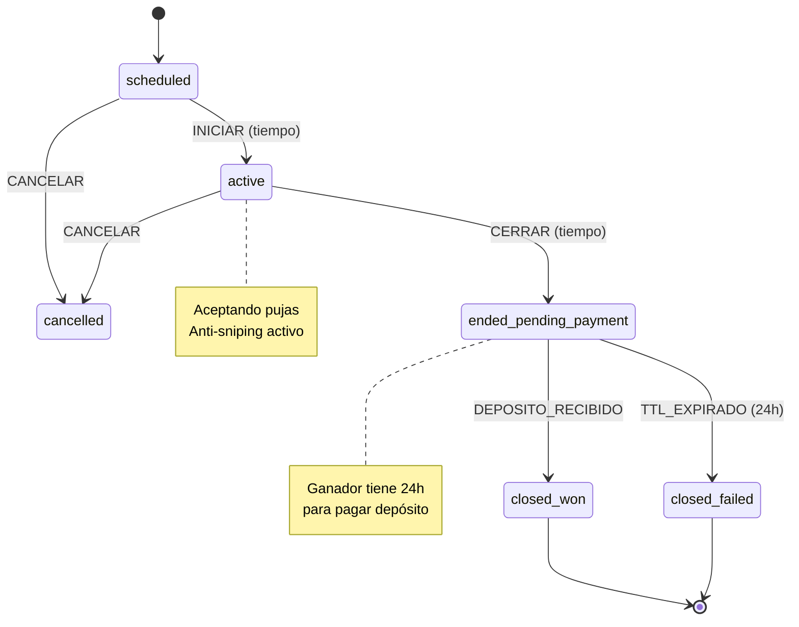
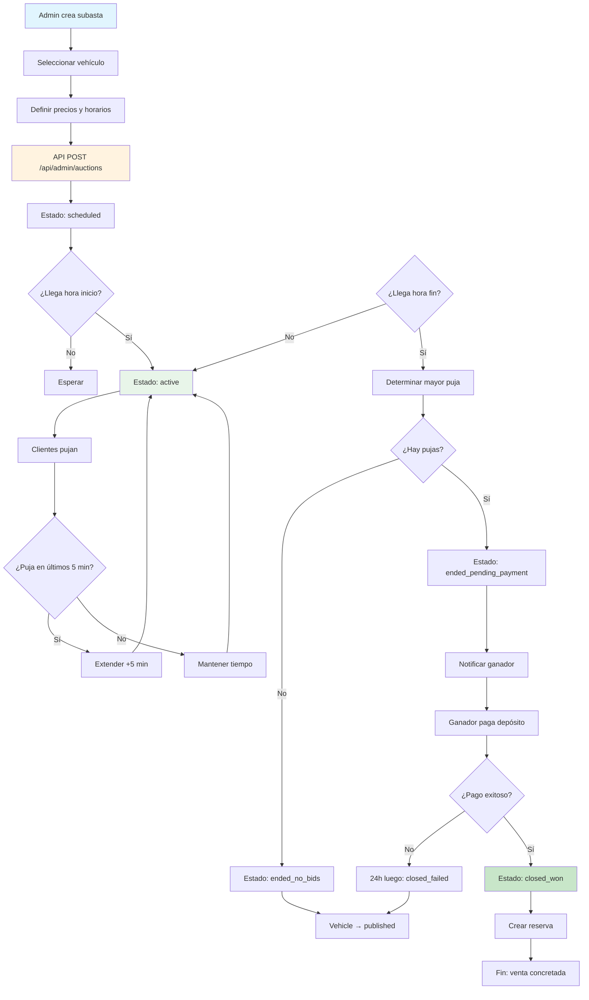
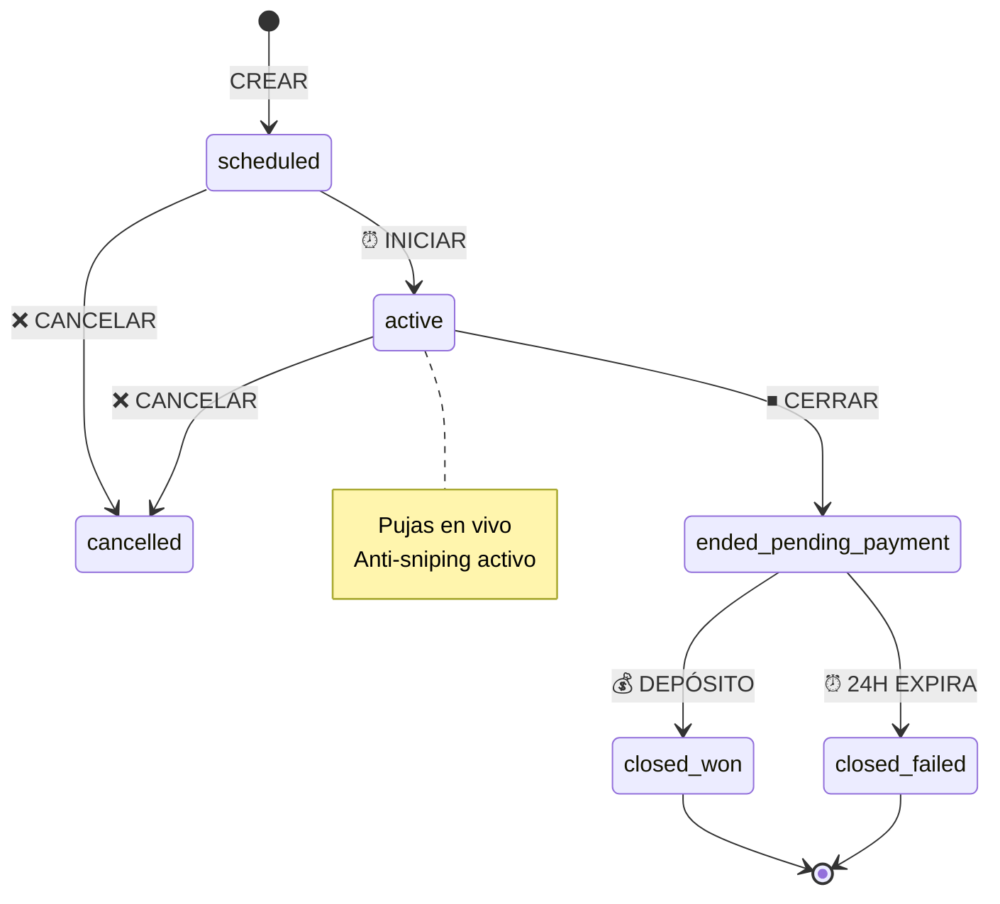

# Módulo Subastas - Documentación Técnica y Operativa

```
Version: 1.0
Fecha: 2026-02-19
Responsable: Jeans Selfene
Relacionado con: PLAN-TRABAJO-MTG v1.x
---
Historial de cambios:
| Versión | Fecha | Responsable | Cambios |
|---------|-------|-------------|---------|
| 1.0 | 2026-02-19 | Jeans Selfene | Versión inicial |
```

---

## A) MANUAL TÉCNICO

### 1. Propósito del Módulo

El módulo de Subastas permite subastar vehículos en la plataforma MTG. Los usuarios pueden pujar por vehículos durante un tiempo definido, y el ganador debe completar el pago de un depósito para quedarse con el vehículo.

**Características:**
- Creación y programación de subastas
- Sistema de pujas en tiempo real
- Anti-sniping (extensión automática)
- Determinación de ganador al cierre
- Cobro de depósito al ganador
- Integración con módulo de pagos

### 2. Arquitectura Interna

#### Archivos Involucrados

| Archivo | Propósito |
|---------|-----------|
| [`app/(public)/subastas/page.tsx`](app/(public)/subastas/page.tsx) | Catálogo público de subastas |
| [`app/(public)/subastas/[id]/page.tsx`](app/(public)/subastas/[id]/page.tsx) | Detalle de subasta |
| [`app/admin/subastas/page.tsx`](app/admin/subastas/page.tsx) | Admin list subastas |
| [`app/admin/subastas/nuevo/page.tsx`](app/admin/subastas/nuevo/page.tsx) | Crear subasta |
| [`app/api/auctions/route.ts`](app/api/auctions/route.ts) | API pública subastas |
| [`app/api/admin/auctions/route.ts`](app/api/admin/auctions/route.ts) | API admin |
| [`app/api/auctions/[id]/deposit/route.ts`](app/api/auctions/[id]/deposit/route.ts) | Depósito ganador |
| [`lib/core/auction-guards.ts`](lib/core/auction-guards.ts) | Guards de subastas |
| [`lib/core/auction-transactions.ts`](lib/core/auction-transactions.ts) | Transacciones |
| [`lib/core/anti-sniping.ts`](lib/core/anti-sniping.ts) | Anti-sniping |

### 3. Tablas Relacionadas (Schema + Índices)

#### Tabla: `auctions`

```sql
CREATE TABLE auctions (
    id TEXT PRIMARY KEY,
    vehicle_id TEXT NOT NULL REFERENCES vehicles(id),
    starting_price INTEGER NOT NULL,
    min_increment INTEGER DEFAULT 10000,
    start_time TEXT NOT NULL,
    end_time TEXT NOT NULL,
    status TEXT DEFAULT 'scheduled' CHECK(status IN ('scheduled','active','ended_pending_payment','closed_won','closed_failed','cancelled','expired','ended_no_bids')),
    winner_id TEXT NULL,
    winner_bid_id TEXT NULL,
    payment_expires_at TEXT NULL,
    created_by TEXT NULL REFERENCES users(id),
    created_at TEXT DEFAULT CURRENT_TIMESTAMP,
    updated_at TEXT DEFAULT CURRENT_TIMESTAMP
);
```

#### Tabla: `bids`

```sql
CREATE TABLE bids (
    id TEXT PRIMARY KEY,
    auction_id TEXT NOT NULL REFERENCES auctions(id),
    user_id TEXT NULL,
    bidder_name TEXT NOT NULL,
    bidder_phone TEXT NOT NULL,
    bidder_email TEXT NULL,
    amount INTEGER NOT NULL,
    is_winner INTEGER DEFAULT 0,
    created_at TEXT DEFAULT CURRENT_TIMESTAMP
);
```

#### Índices

```sql
CREATE INDEX idx_auctions_vehicle_id ON auctions(vehicle_id);
CREATE INDEX idx_auctions_status ON auctions(status);
CREATE INDEX idx_auctions_end_time ON auctions(end_time);
CREATE INDEX idx_bids_auction_id ON bids(auction_id);
CREATE INDEX idx_bids_amount ON bids(amount DESC);
```

### 4. Máquina de Estados

**Estados:**

| Estado | Descripción | ¿Activa? |
|--------|-------------|----------|
| `scheduled` | Programada, no iniciada | ❌ No |
| `active` | En vivo, aceptando pujas | ✅ Sí |
| `ended_pending_payment` | Cerrada, esperando depósito | ❌ No |
| `closed_won` | Ganador pagó | ❌ No |
| `closed_failed` | Ganador no pagó | ❌ No |
| `cancelled` | Cancelada por admin | ❌ No |
| `expired` | Expirada (sin uso) | ❌ No |
| `ended_no_bids` | Terminada sin pujas | ❌ No |

**Definición de Subasta Activa:**
> Subasta activa = `status` IN ('scheduled', 'active')



### 5. Guards y Reglas de Negocio

#### Regla: SUBASTA_SOLO_PUBLICADOS
```typescript
// Solo vehículos publicados pueden subastarse
const vehicle = await getVehicleById(vehicleId);
if (vehicle.status !== 'published') {
  throw new Error("Solo vehículos publicados pueden subastarse");
}
```

#### Regla: SUBASTA_BLOQUEA_RESERVA
```typescript
// No permitir reserva si hay subasta activa
const hasAuction = await hasActiveAuction(vehicleId);
if (hasAuction) {
  throw new Error("Vehículo está en subasta");
}
```

#### Regla: SUBASTA_PUJA_MINIMA
```typescript
// Pujas deben ser mayores al mínimo
const minBid = currentHighestBid + auction.min_increment;
if (bidAmount < minBid) {
  throw new Error(`Monto mínimo: $${minBid}`);
}
```

#### Regla: ANTI_SNIPING ([`lib/core/anti-sniping.ts`](lib/core/anti-sniping.ts))
```typescript
// Extender tiempo si puja en últimos 5 minutos
const ANTI_SNIPING_MINUTES = 5;
const newEndTime = new Date(auction.end_time);
if (timeRemaining < ANTI_SNIPING_MINUTES * 60 * 1000) {
  newEndTime.setMinutes(newEndTime.getMinutes() + ANTI_SNIPING_MINUTES);
  await updateAuction(auction.id, { end_time: newEndTime });
}
```

#### Funciones de Guards ([`lib/core/auction-guards.ts`](lib/core/auction-guards.ts))

```typescript
// Verificar si puede pujar
export function canPlaceBid(auction, bidAmount, currentHighestBid) {
  if (auction.status !== 'active') {
    return { valid: false, error: 'Subasta no activa' };
  }
  
  if (!hasAuctionStarted(auction)) {
    return { valid: false, error: 'Aún no inicia' };
  }
  
  if (hasAuctionEnded(auction)) {
    return { valid: false, error: 'Ya terminó' };
  }
  
  const minAmount = currentHighestBid 
    ? currentHighestBid + auction.min_increment 
    : auction.starting_price;
    
  if (bidAmount < minAmount) {
    return { valid: false, minAmount };
  }
  
  return { valid: true, minAmount };
}
```

### 6. Endpoints API

| Método | Endpoint | Descripción |
|--------|----------|-------------|
| GET | `/api/auctions` | Listar subastas públicas |
| GET | `/api/auctions/[id]` | Detalle subasta |
| POST | `/api/auctions/[id]/bid` | Hacer puja |
| GET | `/api/admin/auctions` | Listar (admin) |
| POST | `/api/admin/auctions` | Crear subasta |
| PUT | `/api/admin/auctions/[id]` | Actualizar |
| POST | `/api/admin/auctions/[id]/start` | Iniciar |
| POST | `/api/admin/auctions/[id]/cancel` | Cancelar |
| POST | `/api/admin/auctions/[id]/close` | Cerrar manual |
| POST | `/api/auctions/[id]/deposit` | Depósito ganador |

### 7. Dependencias

- **D1 Database**: Almacenamiento
- **lib/core/auction-guards.ts**: Validadores
- **lib/core/anti-sniping.ts**: Extensión automática
- **lib/core/auction-transactions.ts**: Transacciones
- **app/api/webhooks/payment**: Confirmación de depósito

### 8. Riesgos Conocidos

| Riesgo | Impacto | Mitigación |
|--------|---------|-------------|
| Sniping | Ultimo segundo | Anti-sniping 5 min |
| Race condition | Pujas cruzadas | Transacciones atómicas |
| Tiempo cliente | Manipulación | Usar tiempo servidor |
| Doble puja | Estado incorrecto | Debounce en cliente |

### 9. Reglas de Exclusión

- **SUBASTA_BLOQUEA_RESERVA**: Si hay subasta activa, no se puede reservar
- **RESERVA_BLOQUEA_SUBASTA**: Si hay reserva activa, no se puede crear subasta
- **EXCLUSIVIDAD**: Un vehículo no puede tener ambos

### 10. Consideraciones de Rendimiento

1. **Índice en amount DESC**: Para obtener mayor puja rápido
2. **Índice en end_time**: Para cron de cierre
3. **Tiempo del servidor**: Siempre usar DB time, no cliente

---

## B) MANUAL OPERATIVO

### 1. ¿Qué hace el Módulo?

**Admin:**
- Crear subastas programadas
- Iniciar/cancelar subastas
- Cerrar manualmente
- Ver pujas y determinar ganador

**Usuario (Cliente):**
- Ver subastas activas
- Hacer pujas
- Ver estado de sus pujas
- Pagar depósito si gana

### 2. Flujo Paso a Paso

#### Crear Subasta (Admin)

```
1. Admin va a /admin/subastas/nuevo
2. Selecciona vehículo
3. Define:
   - Precio inicial
   - Incremento mínimo
   - Fecha/hora inicio
   - Fecha/hora fin
4. Click en "Crear Subasta"
5. Estado = scheduled
6. Vehículo marcado como no disponible para reserva
```

#### Pujar (Cliente)

```
1. Cliente ve subasta activa
2. Ingresa monto de puja
3. Click en "Pujar"
4. Sistema valida:
   - Usuario autenticado
   - Subasta activa
   - Monto mínimo
5. Sistema registra puja
6. UI actualiza precio actual
7. Si puja en últimos 5 min: extender tiempo
```

#### Cerrar Subasta

```
1. Tiempo llega a end_time
2. Cron detecta subastas terminadas
3. Sistema determina mayor puja
4. Si hay ganador:
   - Estado = ended_pending_payment
   - payment_expires = +24h
   - Notificar ganador
5. Si no hay pujas:
   - Estado = ended_no_bids
   - Vehículo vuelve a published
```

#### Pagar Depósito (Ganador)

```
1. Ganador recibe notificación
2. Va a página de subasta
3. Click en "Pagar Depósito"
4. Redirect a gateway de pago
5. Paga depósito
6. Webhook confirma
7. Estado = closed_won
8. Crear reserva automáticamente
```

### 3. Permisos por Rol

| Acción | Admin | Sales | Ops |
|--------|-------|-------|-----|
| Ver subastas | ✅ | ✅ | ✅ |
| Crear subasta | ✅ | ❌ | ❌ |
| Iniciar/cancelar | ✅ | ❌ | ❌ |
| Cerrar manualmente | ✅ | ❌ | ❌ |
| Ver todas las pujas | ✅ | ✅ | ❌ |
| Hacer puja | ✅ | ✅ | ✅ |

### 4. Escenarios Normales

| Escenario | Comportamiento |
|-----------|----------------|
| Nueva puja | Mayor precio actualiza |
| Anti-sniping | +5 min si puja en último momento |
| Subasta termina | Mayor puja es winner |
| Ganador no paga | 24h luego → closed_failed |
| Sin pujas | Estado = ended_no_bids |

### 5. Escenarios de Error

| Error | Causa | Solución |
|-------|-------|----------|
| "Monto muy bajo" | Debajo del mínimo | Ingresar >= mínimo |
| "Subasta no activa" | Fuera de horario | Esperar o verificar |
| "Error al pujar" | Validación fallida | Revisar datos |
| Depósito no confirmado | Gateway falló | Reintentar |

### 6. ¿Qué hacer si falla?

1. **Puja no registrada**: Verificar logs, reprocesar
2. **Anti-sniping no funciona**: Revisar cron
3. **Ganador no notificado**: Enviar manualmente
4. **Depósito no confirmado**: Verificar webhook

### 7. KPIs Asociados

| KPI | Descripción | Meta |
|-----|-------------|------|
| SUB-01 | Subastas activas | >10 |
| SUB-02 | Pujas/subasta (prom) | >5 |
| SUB-03 | Tasa de cierre con venta | >60% |
| SUB-04 | Tiempo promedio de puja | <2h antes fin |
| SUB-05 | Depósitos completados | >80% |

---

## C) DIAGRAMA

### Diagrama de Flujo de Subasta



### Diagrama de Estados



### Diagrama de Arquitectura

```mermaid
graph TB
    subgraph Cliente
        AuctionPage[/subastas/[id]]
        BidForm[Form puja]
    end
    
    subgraph API
        PublicAPI[/api/auctions]
        AdminAPI[/api/admin/auctions]
        DepositAPI[/api/auctions/[id]/deposit]
    end
    
    subgraph Core
        Guards[Auction Guards]
        AntiSnipe[Anti-sniping]
        Atomic[Atomic Transactions]
    end
    
    subgraph Data
        D1[(D1: auctions)]
        Pay[(Payment Gateway)]
    end
    
    AuctionPage --> BidForm
    BidForm --> PublicAPI
    PublicAPI --> Guards
    Guards --> AntiSnipe
    AntiSnipe --> Atomic
    Atomic --> D1
    
    AdminAPI --> Atomic
    DepositAPI --> Atomic
    Pay --> DepositAPI
    
    style D1 fill:#ffecb3
    style Guards fill:#ffcdd2
    style AntiSnipe fill:#ffe0b2
```
