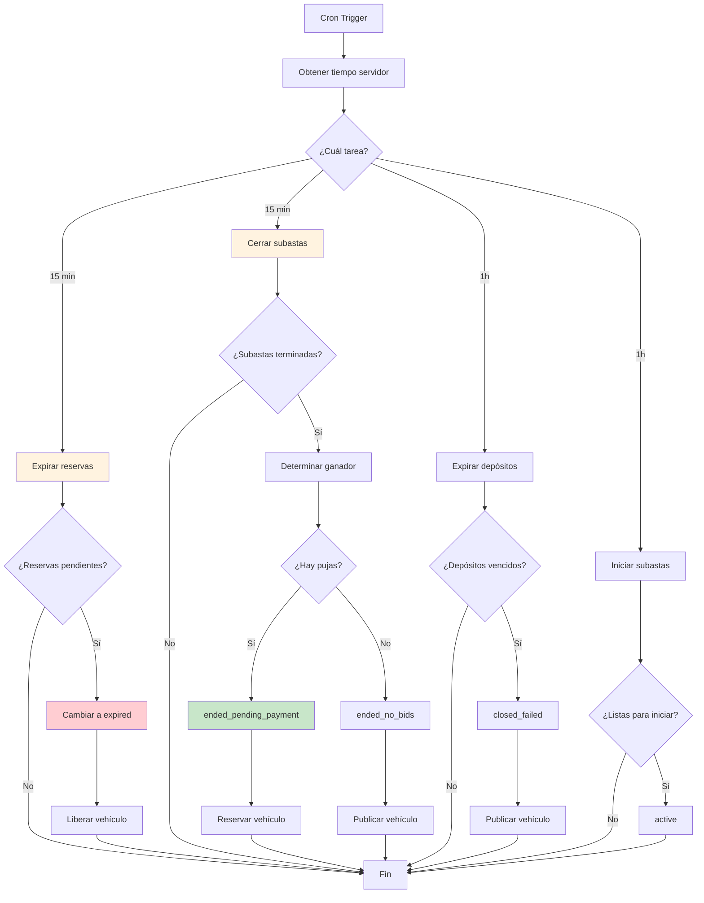
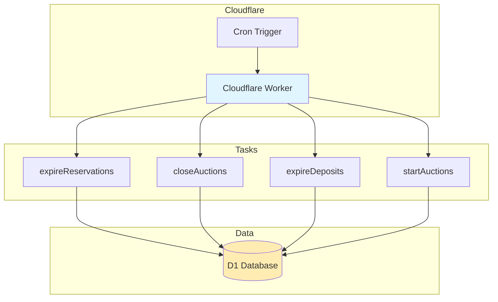

# Módulo Scheduler - Documentación Técnica y Operativa

```
Version: 1.0
Fecha: 2026-02-19
Responsable: Jeans Selfene
Relacionado con: PLAN-TRABAJO-MTG v1.x
---
Historial de cambios:
| Versión | Fecha | Responsable | Cambios |
|---------|-------|-------------|---------|
| 1.0 | 2026-02-19 | Jeans Selfene | Versión inicial |
```

---

## A) MANUAL TÉCNICO

### 1. Propósito del Módulo

El módulo Scheduler maneja tareas programadas automáticas en la plataforma MTG mediante Cloudflare Workers cron. Estas tareas mantienen la consistencia del sistema sin intervención manual.

**Tareas programadas:**
- Expiración de reservas pendientes
- Cierre de subastas terminadas
- Expiración de depósitos de subastas
- Limpieza de datos temporales

### 2. Arquitectura Interna

#### Archivos Involucrados

| Archivo | Propósito |
|---------|-----------|
| [`functions/api/cron/expirations.ts`](functions/api/cron/expirations.ts) | Handler principal de cron |
| [`wrangler.toml`](wrangler.toml) | Configuración de triggers cron |

#### Configuración Wrangler

```toml
# wrangler.toml
[[triggers]]
crons = [
  "*/15 * * * *",  # Cada 15 minutos
  "0 * * * *",      # Cada hora
]
```

### 3. Tareas de Cron

#### 3.1 Expirar Reservas Pendientes

```typescript
// Cada 15 minutos
export async function expirePendingReservations(db: D1Database) {
  // Buscar reservas pending_payment o paid
  // que han excedido expires_at
  // Cambiar estado a expired
  // Liberar vehículo (volver a published)
}
```

**Criteria:**
- `status` IN ('pending_payment', 'paid')
- `expires_at` < now

**Acción:**
- Cambiar status a 'expired'
- Notificar al cliente

#### 3.2 Cerrar Subastas Terminadas

```typescript
// Cada 15 minutos
export async function closeEndedAuctions(db: D1Database) {
  // Buscar subastas con status='active' y end_time < now
  // Determinar ganador (mayor puja)
  // Cambiar a ended_pending_payment
  // Reservar vehículo
}
```

**Criteria:**
- `status` = 'active'
- `end_time` < now

**Acción:**
- Si hay bids → ended_pending_payment
- Si no hay bids → ended_no_bids
- Reservar vehículo si hay ganador
- Notificar al ganador

#### 3.3 Expirar Depósitos de Subastas

```typescript
// Cada hora
export async function expireAuctionDeposits(db: D1Database) {
  // Buscar ended_pending_payment con payment_expires < now
  // Cambiar a closed_failed
  // Liberar vehículo
}
```

**Criteria:**
- `status` = 'ended_pending_payment'
- `payment_expires_at` < now

**Acción:**
- Cambiar status a 'closed_failed'
- Liberar vehículo (volver a published)
- Notificar al ganador

#### 3.4 Iniciar Subastas Programadas

```typescript
// Cada hora
export async function startScheduledAuctions(db: D1Database) {
  // Buscar scheduled donde start_time <= now
  // Cambiar a active
}
```

**Criteria:**
- `status` = 'scheduled'
- `start_time` <= now

**Acción:**
- Cambiar status a 'active'

### 4. Transacciones Atómicas

Todas las tareas de cron usan transacciones atómicas para garantizar consistencia:

```typescript
// Ejemplo de transacción atómica
await db.batch([
  db.prepare(`UPDATE reservations SET status = ? WHERE id = ?`).bind('expired', id),
  db.prepare(`UPDATE vehicles SET status = 'published' WHERE id = ?`).bind(vehicleId)
]);
```

### 5. Logging y Monitoreo

```typescript
console.log(`[Cron] Expiring ${count} reservations`);
console.log(`[Cron] Closed ${count} auctions`);
console.log(`[Cron] Error: ${error.message}`);
```

---

## B) MANUAL OPERATIVO

### 1. ¿Qué hace el Módulo?

El Scheduler ejecuta automáticamente:
- **Expira reservas** que no pagaron en 48h
- **Cierra subastas** cuando termina el tiempo
- **Maneja depósitos** de subastas no pagados
- **Inicia subastas** programadas

### 2. Frecuencia de Ejecución

| Tarea | Frecuencia | Descripción |
|-------|------------|-------------|
| Expirar reservas | Cada 15 min | Revisa pending > 48h |
| Cerrar subastas | Cada 15 min | Revisa active finished |
| Expirar depósitos | Cada 1h | Revisa ended_pending > 24h |
| Iniciar subastas | Cada 1h | Revisa scheduled ready |

### 3. Escenarios Normales

| Escenario | Resultado |
|-----------|-----------|
| Reserva 48h sin pagar | Estado = expired |
| Subasta termina | Estado = ended_pending_payment |
| Ganador no paga 24h | Estado = closed_failed |
| Llega hora de inicio | Estado = active |

### 4. Escenarios de Error

| Error | Causa | Solución |
|-------|-------|----------|
| Tarea falla | Error de DB | Reintentar en siguiente ciclo |
| Double execution | Cron overlapping | Usar locks o estado |
| Datos inconsistentes | Transacción parcial | Revisión manual |

### 5. ¿Qué hacer si falla?

1. **Verificar logs**: Cloudflare Dashboard > Functions > Logs
2. **Ejecutar manualmente**: Llamar endpoint de cron
3. **Revisión manual**: Verificar estado de entidades afectadas

### 6. KPIs

| KPI | Meta |
|-----|------|
| SCH-01 Ejecución exitosa | >99% |
| SCH-02 Reservas expiradas | Automático |
| SCH-03 Subastas cerradas | Automático |

---

## C) DIAGRAMA

### Flujo de Cron



### Arquitectura de Tareas


