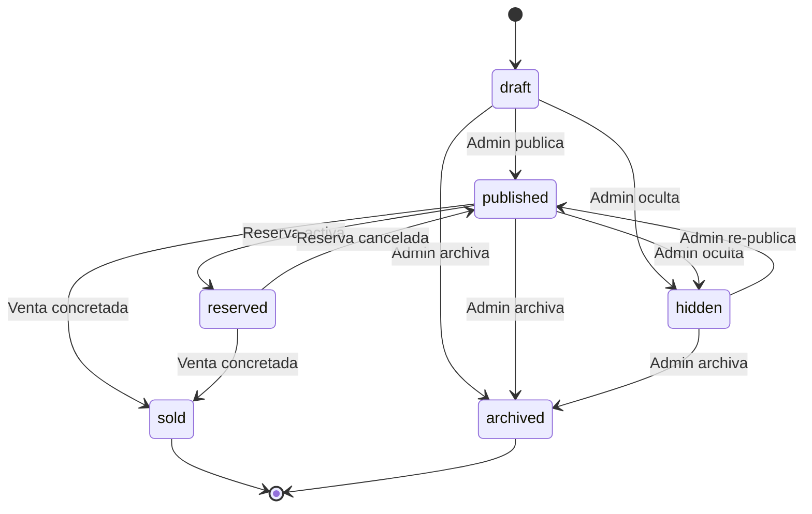
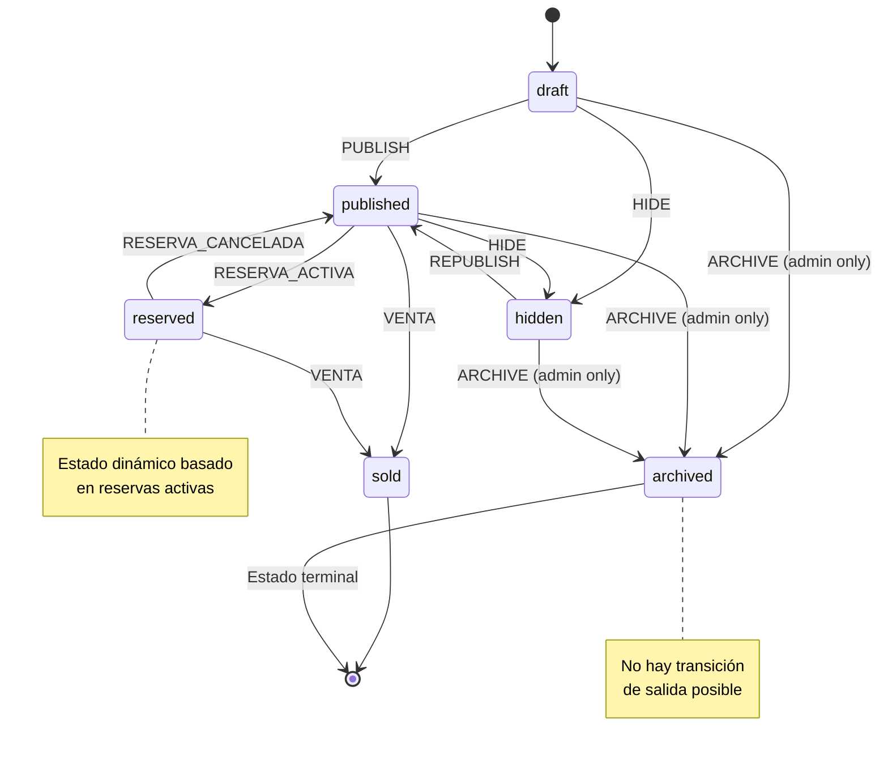

# Módulo Vehículos - Documentación Técnica y Operativa

```
Version: 1.0
Fecha: 2026-02-19
Responsable: Jeans Selfene
Relacionado con: PLAN-TRABAJO-MTG v1.x
---
Historial de cambios:
| Versión | Fecha | Responsable | Cambios |
|---------|-------|-------------|---------|
| 1.0 | 2026-02-19 | Jeans Selfene | Versión inicial |
```

---

## A) MANUAL TÉCNICO

### 1. Propósito del Módulo

El módulo de Vehículos es el sistema central de gestión del inventario de MTG. Permite a los administradores crear, editar, publicar y archivar vehículos en el inventario. Es la base sobre la cual operan los demás módulos (reservas, subastas, consignaciones).

**Objetivos:**
- CRUD completo de vehículos
- Gestión de fotos con almacenamiento en R2
- Control de estados del ciclo de vida del vehículo
- Auditoría completa de cambios
- SEO con slugs únicos

### 2. Arquitectura Interna

#### Archivos Involucrados

| Archivo | Propósito |
|---------|-----------|
| [`app/admin/vehiculos/page.tsx`](app/admin/vehiculos/page.tsx) | Listado de vehículos en admin |
| [`app/admin/vehiculos/nuevo/page.tsx`](app/admin/vehiculos/nuevo/page.tsx) | Formulario de nuevo vehículo |
| [`app/admin/vehiculos/[id]/page.tsx`](app/admin/vehiculos/[id]/page.tsx) | Edición de vehículo existente |
| [`app/api/admin/vehicles/route.ts`](app/api/admin/vehicles/route.ts) | API CRUD vehículos |
| [`app/api/admin/vehicles/[id]/route.ts`](app/api/admin/vehicles/[id]/route.ts) | API detalle vehículo |
| [`app/api/admin/vehicles/[id]/photos/route.ts`](app/api/admin/vehicles/[id]/photos/route.ts) | API gestión de fotos |
| [`lib/db/vehicles.ts`](lib/db/vehicles.ts) | Queries D1 para vehículos |
| [`lib/core/audit.ts`](lib/core/audit.ts) | Sistema de auditoría |

#### Flujo de Creación

```
Admin -> /admin/vehiculos/nuevo
           |
           v
    Formulario datos básicos
           |
           v
    Validación Zod schema
           |
           v
    Generar slug único
           |
           v
    API POST /api/admin/vehicles
           |
           v
    D1 INSERT vehicles
           |
           v
    Auditoría log
           |
           v
    Redirect /admin/vehiculos/[id]
```

### 3. Tablas Relacionadas (Schema + Índices)

#### Tabla: `vehicles`

```sql
CREATE TABLE vehicles (
    id TEXT PRIMARY KEY,
    slug TEXT UNIQUE NOT NULL,
    brand TEXT NOT NULL,
    model TEXT NOT NULL,
    year INTEGER NOT NULL,
    price INTEGER NOT NULL,
    mileage_km INTEGER,
    transmission TEXT CHECK(transmission IN ('manual', 'auto')),
    fuel_type TEXT,
    region TEXT,
    city TEXT,
    status TEXT DEFAULT 'draft' CHECK(status IN ('draft', 'published', 'reserved', 'sold', 'hidden', 'archived')),
    description TEXT,
    created_by TEXT REFERENCES users(id),
    created_at TEXT DEFAULT CURRENT_TIMESTAMP,
    updated_at TEXT DEFAULT CURRENT_TIMESTAMP
);
```

#### Tabla: `vehicle_photos`

```sql
CREATE TABLE vehicle_photos (
    id TEXT PRIMARY KEY,
    vehicle_id TEXT NOT NULL REFERENCES vehicles(id) ON DELETE CASCADE,
    url TEXT NOT NULL,
    position INTEGER DEFAULT 0,
    created_at TEXT DEFAULT CURRENT_TIMESTAMP
);
```

#### Tabla: `documents`

```sql
CREATE TABLE documents (
    id TEXT PRIMARY KEY,
    vehicle_id TEXT NOT NULL REFERENCES vehicles(id) ON DELETE CASCADE,
    type TEXT CHECK(type IN ('contract', 'checklist', 'inspection', 'registration', 'other')),
    url TEXT,
    uploaded_by TEXT REFERENCES users(id),
    created_at TEXT DEFAULT CURRENT_TIMESTAMP
);
```

#### Tabla: `audit_logs`

```sql
CREATE TABLE audit_logs (
    id TEXT PRIMARY KEY,
    user_id TEXT REFERENCES users(id),
    entity_type TEXT NOT NULL,
    entity_id TEXT NOT NULL,
    action TEXT NOT NULL CHECK(action IN ('created', 'updated', 'deleted', 'status_changed')),
    old_value TEXT,
    new_value TEXT,
    created_at TEXT DEFAULT CURRENT_TIMESTAMP
);
```

#### Índices

```sql
CREATE INDEX idx_vehicles_status ON vehicles(status);
CREATE INDEX idx_vehicles_created_at ON vehicles(created_at);
CREATE INDEX idx_vehicles_brand_model ON vehicles(brand, model);
CREATE INDEX idx_vehicles_slug ON vehicles(slug);
CREATE INDEX idx_vehicle_photos_vehicle_id ON vehicle_photos(vehicle_id);
CREATE INDEX idx_documents_vehicle_id ON documents(vehicle_id);
CREATE INDEX idx_audit_logs_entity ON audit_logs(entity_type, entity_id);
```

### 4. Máquina de Estados del Vehículo

**Estados:**

| Estado | Descripción | Visible en Catálogo |
|--------|-------------|---------------------|
| `draft` | Borrador inicial | ❌ No |
| `published` | Disponible para venta | ✅ Sí |
| `hidden` | Oculto por admin | ❌ No |
| `reserved` | Con reserva activa | ⚠️ Indicador |
| `sold` | Vendido | ❌ No |
| `archived` | Retirado de operación | ❌ No |

**Transiciones:**



**Reglas de Transición:**

| Desde | Hacia | Condición |
|-------|-------|-----------|
| draft | published | Usuario admin |
| draft | hidden | Usuario admin |
| draft | archived | Admin (solo admin) |
| published | hidden | Usuario admin |
| published | reserved | Reserva activa detectada |
| published | sold | Venta concretada |
| published | archived | Admin (solo admin) |
| hidden | published | Admin re-publica |
| reserved | published | Reserva cancelada/expirada |
| reserved | sold | Venta concretada |
| archived | (ninguno) | Estado terminal |

### 5. Guards y Reglas de Negocio

#### Regla: VEHICULO_SLUG_UNICO
```typescript
// Generar slug único
export function generateSlug(brand: string, model: string, year: number, id: string): string {
  return `${brand.toLowerCase()}-${model.toLowerCase()}-${year}-${id.slice(0, 8)}`
    .replace(/[^a-z0-9-]/g, '-')
    .replace(/-+/g, '-');
}
```

#### Regla: VEHICULO_ARCHIVED_TERMINAL
```typescript
// Estado archived es terminal - no hay salida
const canChangeFromArchived = (status: string) => status !== 'archived';
```

#### Regla: VEHICULO_SIN_SUBASTA_ACTIVA
```typescript
// Noarchivar si hay subasta activa
const hasActiveAuction = await checkActiveAuction(vehicleId);
if (hasActiveAuction) throw new Error("No se puede archivar con subasta activa");
```

#### Regla: VEHICULO_SIN_RESERVA_ACTIVA
```typescript
// Noarchivar si hay reserva activa
const hasActiveReservation = await checkActiveReservation(vehicleId);
if (hasActiveReservation) throw new Error("No se puede archivar con reserva activa");
```

### 6. Endpoints API

| Método | Endpoint | Descripción |
|--------|----------|-------------|
| GET | `/api/admin/vehicles` | Listar todos los vehículos (admin) |
| POST | `/api/admin/vehicles` | Crear nuevo vehículo |
| GET | `/api/admin/vehicles/[id]` | Obtener vehículo por ID |
| PUT | `/api/admin/vehicles/[id]` | Actualizar vehículo |
| DELETE | `/api/admin/vehicles/[id]` | Eliminar vehículo |
| POST | `/api/admin/vehicles/[id]/photos` | Subir fotos |
| DELETE | `/api/admin/vehicles/[id]/photos/[photo_id]` | Eliminar foto |

### 7. Dependencias

- **D1 Database**: Almacenamiento de vehículos
- **R2 Storage**: Almacenamiento de fotos
- **lib/db/vehicles.ts**: Queries base de datos
- **lib/core/audit.ts**: Sistema de auditoría
- **lib/core/vehicle-guards.ts**: Validadores de negocio
- **Zod**: Validación de esquemas

### 8. Riesgos Conocidos

| Riesgo | Impacto | Mitigación |
|--------|---------|-------------|
| Slug duplicado | Error 500, SEO roto | Validación única con retry |
| Fotos sin R2 | Storage local llena | Validar bucket R2 configurado |
| Cambio de estado incorrecto | Inconsistencia de datos | Guards en cada transición |
| Eliminación con historial | Auditoría incompleta | Soft delete vs hard delete |
| archived reversible | Regla rota | No permitir transición desde archived |

### 9. Reglas de Exclusión

- **No publicar** si el vehículo tiene subasta activa
- **No reservar** si el vehículo está en auction_pending
- **No archivar** si hay reserva o subasta activa
- **No eliminar** registros - usar soft delete (archived)

### 10. Consideraciones de Rendimiento

1. **Slug index**: Útil para SEO lookups
2. **Paginación**: Máximo 50 vehículos por request
3. **Carga de fotos**: Upload paralelo a R2
4. **Auditoría**: Async write para no bloquear UI
5. **Índice compuesto**: (status, created_at) para listados admin

---

## B) MANUAL OPERATIVO

### 1. ¿Qué hace el Módulo?

El módulo de Vehículos permite a los administradores:
- Crear nuevos vehículos en el inventario
- Editar información de vehículos existentes
- Gestionar fotos del vehículo
- Cambiar el estado del vehículo (borrador, publicado, oculto, vendido, archivado)
- Ver historial de cambios (auditoría)
- Eliminar vehículos

### 2. Flujo Paso a Paso

#### Crear Nuevo Vehículo

```
1. Admin entra a /admin/vehiculos/nuevo
2. Completa formulario:
   - Marca (dropdown)
   - Modelo (dropdown)
   - Año (número)
   - Precio (número)
   - Kilometraje (número)
   - Transmisión (select)
   - Tipo combustible (select)
   - Región (select)
   - Ciudad (input)
   - Descripción (textarea)
3. Admin hace click en "Crear"
4. Sistema valida datos
5. Sistema genera slug único
6. Sistema guarda en D1
7. Sistema registra auditoría
8. Redirect a página de edición
9. Admin sube fotos
10. Admin cambia estado a "published"
```

#### Editar Vehículo

```
1. Admin entra a /admin/vehiculos/[id]
2. Modifica campos deseados
3. Sistema detecta cambios
4. Admin guarda cambios
5. Sistema actualiza D1
6. Sistema registra auditoría
7. UI muestra éxito
```

#### Gestionar Fotos

```
1. Admin está en página de edición
2. Arrastra fotos al área de drop
3. Sistema sube a R2
4. Sistema guarda URLs en vehicle_photos
5. UI muestra miniaturas
6. Admin puede reordenar/eliminar
```

### 3. Permisos por Rol

| Acción | Admin | Sales | Ops |
|--------|-------|-------|-----|
| Crear vehículo | ✅ | ❌ | ❌ |
| Editar cualquier vehículo | ✅ | ✅ | ❌ |
| Editar propios | ❌ | ❌ | ✅ |
| Publicar vehículo | ✅ | ✅ | ❌ |
| Ocultar vehículo | ✅ | ✅ | ❌ |
| Archivar vehículo | ✅ | ❌ | ❌ |
| Eliminar fotos | ✅ | ✅ | ❌ |
| Ver auditoría | ✅ | ✅ | ❌ |
| Eliminar vehículo | ✅ | ❌ | ❌ |

### 4. Escenarios Normales

| Escenario | Comportamiento |
|-----------|----------------|
| Crear vehículo nuevo | Entra como draft, luego se publica |
| Editar published | Cambios visibles inmediatamente |
| Subir fotos | URLs guardadas, miniaturas renderizadas |
| Cambiar a hidden | Desaparece del catálogo público |
| Marcar como sold | Se indica como vendido en detalle |

### 5. Escenarios de Error

| Error | Causa | Solución |
|-------|-------|----------|
| Slug ya existe | Vehículo similar existe | Modificar año o agregar sufijo |
| Error al subir foto | R2 no responde | Reintentar o usar fallback |
| No puede archivar | Tiene reserva/subasta activa | Cancelar primero |
| 404 al editar | ID no existe | Verificar URL |
| Campos requeridos | Validación Zod | Completar campos |

### 6. ¿Qué hacer si falla?

1. **Error 500 en creación**: Revisar logs de Cloudflare Functions
2. **Fotos no suben**: Verificar bucket R2 y permisos
3. **Cambios no se guardan**: Revisar red y payload
4. **Estado no cambia**: Verificar que no hay conflicto (reserva/subasta)
5. **Auditoría no registra**: Revisar tabla audit_logs

### 7. KPIs Asociados

| KPI | Descripción | Meta |
|-----|-------------|------|
| VEH-01 | Vehículos creados/mes | >20 |
| VEH-02 | Vehículos publicados | >80% |
| VEH-03 | Tiempo promedio creación | <5 min |
| VEH-04 | Fotos por vehículo (promedio) | >5 |
| VEH-05 | Vehículos vendidos/mes | >10 |

---

## C) DIAGRAMA

### Diagrama de Estados



### Diagrama de Arquitectura

```mermaid
graph TB
    subgraph Frontend
        AdminUI[Admin Panel UI]
        Form[Vehicle Form]
        Gallery[Photo Gallery]
    end
    
    subgraph API
        VehicleAPI[/api/admin/vehicles]
        PhotosAPI[/api/admin/vehicles/[id]/photos]
    end
    
    subgraph Business Logic
        Guards[Vehicle Guards]
        SlugGen[Slug Generator]
        Audit[Audit Logger]
    end
    
    subgraph Data
        D1[(D1 Database)]
        R2[(R2 Storage)]
    end
    
    AdminUI --> VehicleAPI
    AdminUI --> PhotosAPI
    Form --> VehicleAPI
    Gallery --> PhotosAPI
    
    VehicleAPI --> Guards
    VehicleAPI --> SlugGen
    VehicleAPI --> Audit
    
    Guards --> D1
    SlugGen --> D1
    Audit --> D1
    PhotosAPI --> R2
    
    style D1 fill:#ffecb3
    style R2 fill:#c8e6c9
    style Guards fill:#ffcdd2
```
