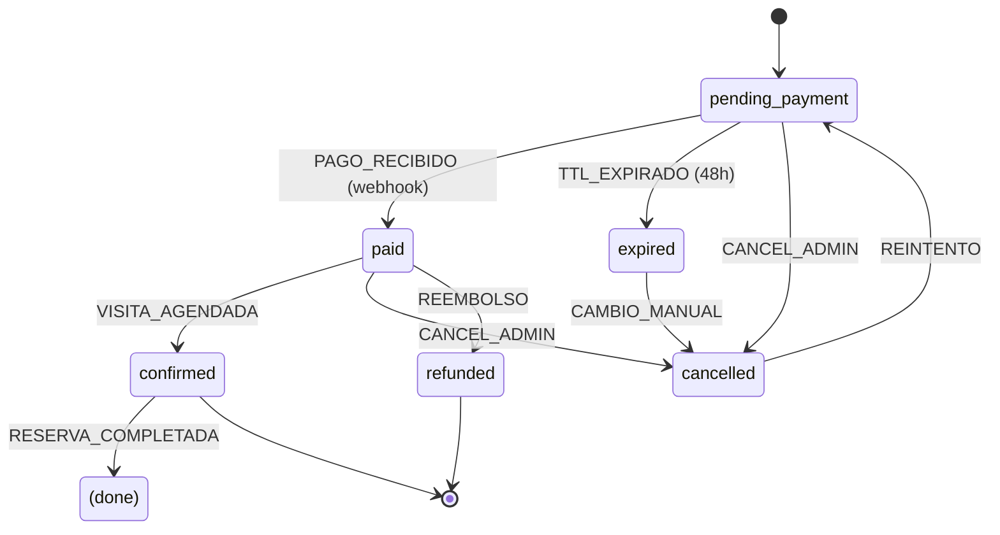
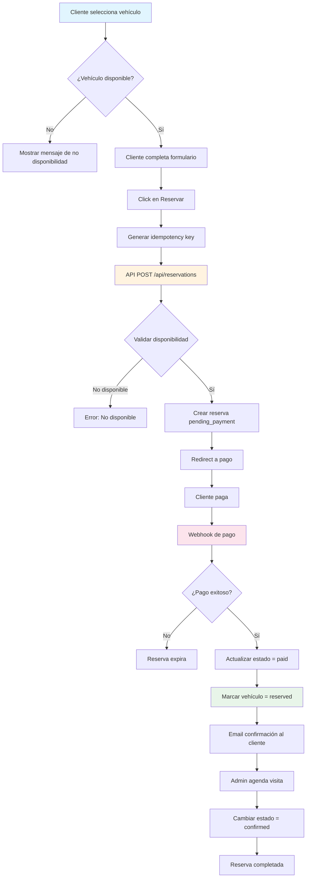
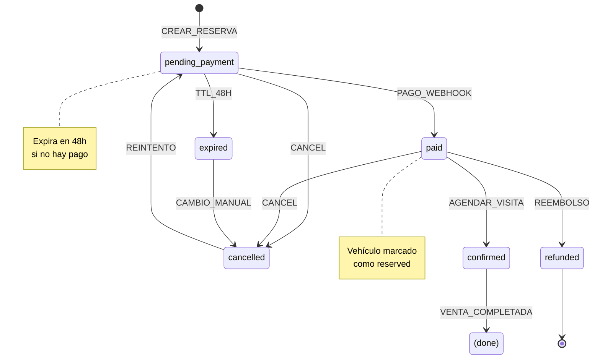

# Módulo Reservas - Documentación Técnica y Operativa

```
Version: 1.0
Fecha: 2026-02-19
Responsable: Jeans Selfene
Relacionado con: PLAN-TRABAJO-MTG v1.x
---
Historial de cambios:
| Versión | Fecha | Responsable | Cambios |
|---------|-------|-------------|---------|
| 1.0 | 2026-02-19 | Jeans Selfene | Versión inicial |
```

---

## A) MANUAL TÉCNICO

### 1. Propósito del Módulo

El módulo de Reservas implementa el sistema de reserva con abono de MTG. Permite a los clientes interesados reservar un vehículo mediante el pago de un abono (depósito), agendar visita y completar la compra.

**Características:**
- Creación de reserva con clave de idempotencia
- Expiración automática en 48 horas
- Confirmación de pago vía webhook
- Cambio de estado automático del vehículo
- Integración con módulo de pagos

### 2. Arquitectura Interna

#### Archivos Involucrados

| Archivo | Propósito |
|---------|-----------|
| [`app/api/reservations/route.ts`](app/api/reservations/route.ts) | API pública de reservas |
| [`app/api/admin/reservations/route.ts`](app/api/admin/reservations/route.ts) | API admin de reservas |
| [`app/api/admin/reservations/[id]/route.ts`](app/api/admin/reservations/[id]/route.ts) | API detalle reserva |
| [`app/admin/reservas/page.tsx`](app/admin/reservas/page.tsx) | Panel admin de reservas |
| [`components/reservation-modal.tsx`](components/reservation-modal.tsx) | Modal de reserva público |
| [`lib/db/reservations.ts`](lib/db/reservations.ts) | Queries D1 para reservas |
| [`lib/core/reservation-guards.ts`](lib/core/reservation-guards.ts) | Guards de reservas |
| [`lib/core/atomic-transactions.ts`](lib/core/atomic-transactions.ts) | Transacciones atómicas |
| [`app/api/webhooks/payment/route.ts`](app/api/webhooks/payment/route.ts) | Webhook de pago |

### 3. Tablas Relacionadas (Schema + Índices)

#### Tabla: `reservations`

```sql
CREATE TABLE reservations (
    id TEXT PRIMARY KEY,
    vehicle_id TEXT NOT NULL REFERENCES vehicles(id),
    user_id TEXT REFERENCES users(id),
    customer_name TEXT,
    customer_email TEXT,
    customer_phone TEXT,
    amount INTEGER NOT NULL,
    status TEXT DEFAULT 'pending_payment' CHECK(status IN ('pending_payment', 'paid', 'confirmed', 'expired', 'cancelled', 'refunded')),
    payment_id TEXT,
    idempotency_key TEXT UNIQUE,
    expires_at TEXT NOT NULL,
    created_at TEXT DEFAULT CURRENT_TIMESTAMP,
    updated_at TEXT DEFAULT CURRENT_TIMESTAMP
);
```

#### Tabla: `payment_transactions`

```sql
CREATE TABLE payment_transactions (
    id TEXT PRIMARY KEY,
    entity_type TEXT NOT NULL CHECK(entity_type IN ('reservation', 'auction_deposit', 'auction_winner')),
    entity_id TEXT NOT NULL,
    amount INTEGER NOT NULL,
    currency TEXT DEFAULT 'CLP',
    payment_method TEXT,
    payment_id TEXT,
    status TEXT DEFAULT 'pending' CHECK(status IN ('pending', 'completed', 'failed', 'refunded', 'cancelled')),
    idempotency_key TEXT UNIQUE,
    metadata TEXT,
    created_at TEXT DEFAULT CURRENT_TIMESTAMP,
    updated_at TEXT DEFAULT CURRENT_TIMESTAMP
);
```

#### Índices

```sql
CREATE INDEX idx_reservations_vehicle_id ON reservations(vehicle_id);
CREATE INDEX idx_reservations_status ON reservations(status);
CREATE INDEX idx_reservations_created_at ON reservations(created_at);
CREATE INDEX idx_reservations_expires ON reservations(expires_at);
CREATE INDEX idx_payment_transactions_entity ON payment_transactions(entity_type, entity_id);
CREATE INDEX idx_payment_transactions_idempotency ON payment_transactions(idempotency_key);
```

### 4. Máquina de Estados de Reservas

**Estados:**

| Estado | Descripción | ¿Activo? |
|--------|-------------|----------|
| `pending_payment` | Iniciada, esperando pago | ✅ Sí |
| `paid` | Pago recibido (webhook) | ✅ Sí |
| `confirmed` | Visita agendada | ✅ Sí |
| `expired` | TTL excedido sin pago | ❌ No |
| `cancelled` | Cancelada manualmente | ❌ No |
| `refunded` | Pago reversado | ❌ No |

**Definición de Reserva Activa:**
> Reserva activa = `status` IN ('pending_payment', 'paid', 'confirmed')



### 5. Guards y Reglas de Negocio

#### Regla: RESERVA_VEHICULO_PUBLICADO
```typescript
// Solo vehículos publicados pueden reservarse
const vehicle = await getVehicleById(vehicleId);
if (vehicle.status !== 'published') {
  throw new Error("Solo vehículos publicados pueden reservarse");
}
```

#### Regla: RESERVA_SIN_SUBASTA_ACTIVA
```typescript
// No permitir reserva si hay subasta activa
const hasAuction = await hasActiveOrScheduledAuction(vehicleId);
if (hasAuction) {
  throw new Error("Vehículo está en subasta");
}
```

#### Regla: RESERVA_IDEMPOTENCY
```typescript
// Verificar idempotencia para evitar duplicados
const existing = await idempotencyKeyExists(key);
if (existing) {
  return existing; // Retornar reserva existente
}
```

#### Regla: RESERVA_EXPIRA_48H
```typescript
// Reservas expiran en 48 horas
const expiresAt = new Date(Date.now() + 48 * 60 * 60 * 1000);
```

#### Funciones de Guards ([`lib/core/reservation-guards.ts`](lib/core/reservation-guards.ts))

```typescript
// Estados activos
const ACTIVE_STATUSES = ['pending_payment', 'paid', 'confirmed'];

// Transiciones válidas
const validTransitions = {
  'pending_payment': ['paid', 'expired', 'cancelled'],
  'paid': ['confirmed', 'expired', 'cancelled', 'refunded'],
  'confirmed': ['refunded'],
  'expired': [],
  'cancelled': [],
  'refunded': []
};

// Verificar transición válida
export function isValidStatusTransition(current, newStatus) {
  return validTransitions[current]?.includes(newStatus) ?? false;
}
```

### 6. Endpoints API

| Método | Endpoint | Descripción |
|--------|----------|-------------|
| POST | `/api/reservations` | Crear nueva reserva (público) |
| GET | `/api/reservations/[id]` | Obtener reserva por ID |
| GET | `/api/admin/reservations` | Listar reservas (admin) |
| PUT | `/api/admin/reservations/[id]` | Actualizar reserva |
| POST | `/api/admin/reservations/[id]/confirm` | Confirmar visita |
| POST | `/api/admin/reservations/[id]/cancel` | Cancelar reserva |
| POST | `/api/webhooks/payment` | Webhook de pago |

### 7. Dependencias

- **D1 Database**: Almacenamiento de reservas
- **lib/db/reservations.ts**: Queries de reservas
- **lib/core/reservation-guards.ts**: Validadores de estado
- **lib/core/atomic-transactions.ts**: Transacciones atómicas
- **lib/api/payments.ts**: Integración con gateway de pago

### 8. Riesgos Conocidos

| Riesgo | Impacto | Mitigación |
|--------|---------|-------------|
| Doble reserva | Conflicto de vehículo | Verificar disponibilidad antes de crear |
| Webhook duplicado | Estado inconsistente | Clave idempotencia obligatoria |
| Expiración no ejecuta | Reserva atascada | Cron job de expiraciones |
| Race condition | Estado incorrecto | Transacciones atómicas |

### 9. Reglas de Exclusión

- **RESERVA_BLOQUEA_SUBASTA**: Si hay reserva activa, no se puede crear subasta
- **SUBASTA_BLOQUEA_RESERVA**: Si hay subasta activa/programada, no se puede reservar
- **EXCLUSIVIDAD**: Un vehículo no puede tener reserva Y subasta activas

### 10. Consideraciones de Rendimiento

1. **Idempotency key index**: Búsqueda rápida para evitar duplicados
2. **Expiración por cron**: No confiar en TTL de base de datos
3. **Transacciones atómicas**: Asegurar consistencia en cambio de estados
4. **Webhook idempotente**: Ignorar webhooks repetidos

---

## B) MANUAL OPERATIVO

### 1. ¿Qué hace el Módulo?

El módulo de Reservas permite:
- **Clientes**: Reservar vehículos con abono, ver estado de su reserva
- **Admin**: Gestionar reservas, confirmar visitas, cancelar, reembolsar

### 2. Flujo Paso a Paso

#### Flujo Cliente (Reservar)

```
1. Cliente ve vehículo en catálogo
2. Click en botón "Reservar"
3. Modal abre con formulario:
   - Nombre completo (requerido)
   - Teléfono (requerido)
   - Email (opcional)
4. Cliente completa datos
5. Cliente hace click en "Pagar Abono"
6. Sistema genera idempotency key
7. Sistema crea reserva en estado "pending_payment"
8. Redirección a gateway de pago
9. Cliente paga
10. Gateway envía webhook
11. Sistema actualiza estado a "paid"
12. Sistema marca vehículo como "reserved"
13. Cliente recibe confirmación
```

#### Flujo Admin (Gestionar)

```
1. Admin entra a /admin/reservas
2. Ve lista de reservas
3. Puede filtrar por estado
4. Click en reserva para ver detalles
5. Acciones disponibles:
   - Confirmar visita (paid → confirmed)
   - Cancelar reserva (paid → cancelled)
   - Reembolsar (paid → refunded)
```

### 3. Permisos por Rol

| Acción | Admin | Sales | Ops |
|--------|-------|-------|-----|
| Ver todas las reservas | ✅ | ✅ | ❌ |
| Crear reserva | ✅ | ✅ | ❌ |
| Confirmar visita | ✅ | ✅ | ❌ |
| Cancelar reserva | ✅ | ✅ | ❌ |
| Reembolsar | ✅ | ❌ | ❌ |
| Eliminar reserva | ✅ | ❌ | ❌ |

### 4. Escenarios Normales

| Escenario | Comportamiento |
|-----------|----------------|
| Reserva nueva | Estado pending_payment, expira en 48h |
| Pago exitoso | Estado cambia a paid, vehículo a reserved |
| Cliente no paga | Cron expira, estado = expired |
| Visita agendada | Estado = confirmed, listo para venta |

### 5. Escenarios de Error

| Error | Causa | Solución |
|-------|-------|----------|
| "Vehículo no disponible" | Hay reserva/subasta activa | Esperar o cancelar anterior |
| "Reserva duplicada" | Misma idempotency key | Retornar reserva existente |
| "Pago fallido" | Gateway rechaza tarjeta | Cliente reintenta |
| "Webhook inválido" | Firma no coincide | Ignorar webhook |

### 6. ¿Qué hacer si falla?

1. **Reserva atascada en pending_payment**: Verificar si cliente pagó, procesar manualmente
2. **Webhook no llega**: Verificar logs del gateway, reprocesar manualmente
3. **Vehículo no cambia a reserved**: Revisar lógica del webhook
4. **Expiración no funciona**: Ejecutar `/api/cron/expirations` manualmente

### 7. KPIs Asociados

| KPI | Descripción | Meta |
|-----|-------------|------|
| RES-01 | Reservas creadas/mes | >50 |
| RES-02 | Tasa de conversión a paid | >60% |
| RES-03 | Tasa de cancelación | <15% |
| RES-04 | Tiempo promedio a confirmación | <24h |
| RES-05 | Reservas completadas (venta) | >40% |

---

## C) DIAGRAMA

### Diagrama de Flujo de Reserva



### Diagrama de Estados



### Diagrama de Arquitectura

```mermaid
graph TB
    subgraph Cliente
        Modal[Reservation Modal]
        Form[Datos cliente]
    end
    
    subgraph API
        CreateAPI[/api/reservations]
        AdminAPI[/api/admin/reservations]
        Webhook[/api/webhooks/payment]
    end
    
    subgraph Core
        Guards[Reservation Guards]
        Idemp[Idempotency Check]
        Atomic[Atomic Transactions]
    end
    
    subgraph Data
        D1[(D1: reservations)]
        Pay[(Payment Gateway)]
    end
    
    Modal --> Form
    Form --> CreateAPI
    CreateAPI --> Idemp
    Idemp --> Guards
    Guards --> Atomic
    Atomic --> D1
    
    Pay --> Webhook
    Webhook --> Atomic
    Atomic --> D1
    
    AdminAPI --> Atomic
    
    style D1 fill:#ffecb3
    style Guards fill:#ffcdd2
    style Atomic fill:#ffe0b2
```
