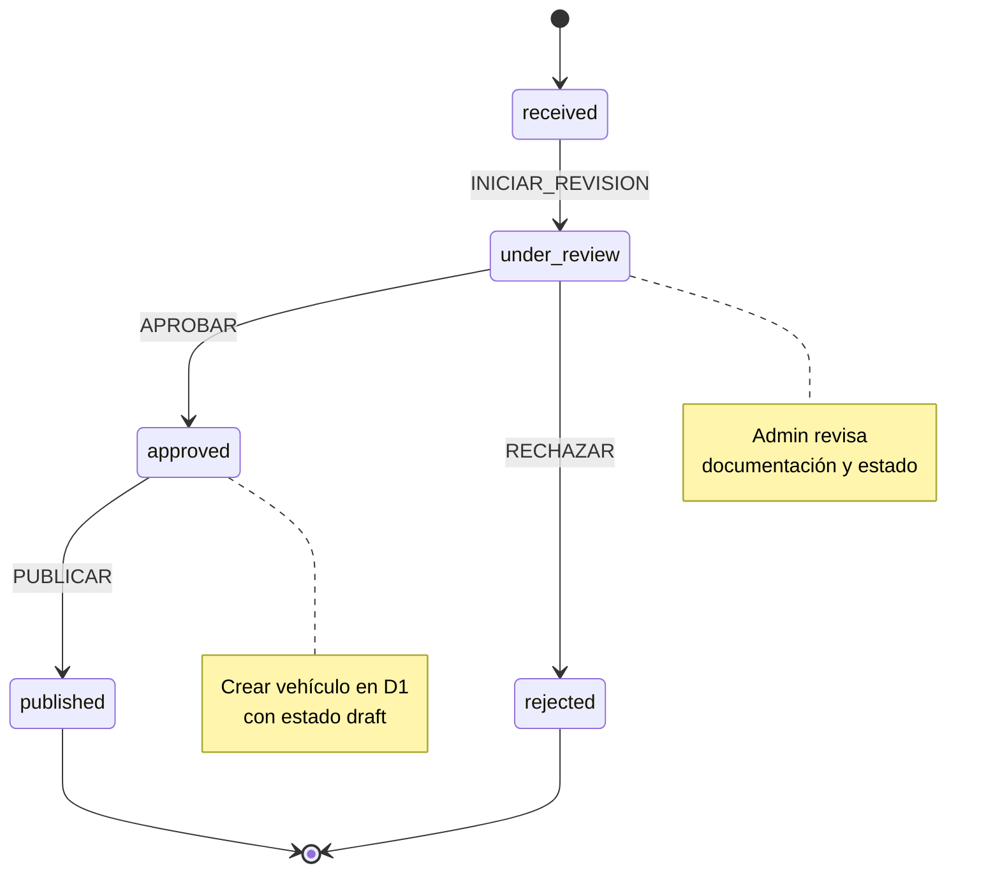
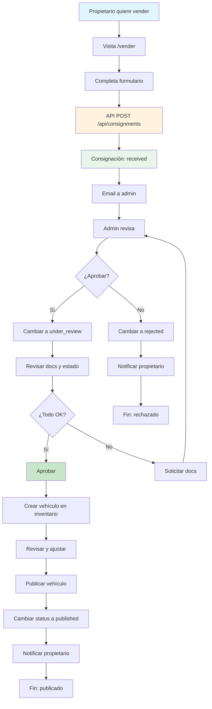
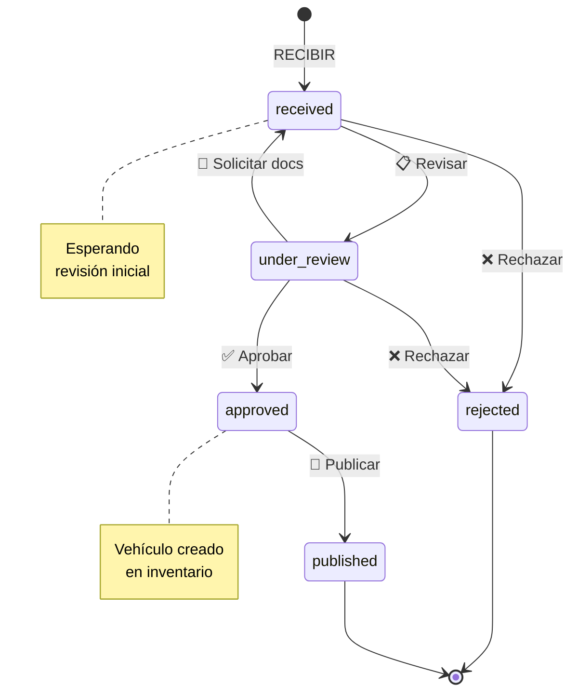

# Módulo Consignación - Documentación Técnica y Operativa

```
Version: 1.0
Fecha: 2026-02-19
Responsable: Jeans Selfene
Relacionado con: PLAN-TRABAJO-MTG v1.x
---
Historial de cambios:
| Versión | Fecha | Responsable | Cambios |
|---------|-------|-------------|---------|
| 1.0 | 2026-02-19 | Jeans Selfene | Versión inicial |
```

---

## A) MANUAL TÉCNICO

### 1. Propósito del Módulo

El módulo de Consignación permite a los propietarios de vehículos confiar sus autos a MTG para su venta. El vehículo pasa por un proceso de revisión y aprobación antes de ser publicado en el catálogo.

**Características:**
- Recepción de vehículos en consignación
- Proceso de revisión y aprobación
- Gestión de fotos del vehículo en consignación
- Vinculación con inventario (cuando se aprueba)
- Notas y seguimiento del proceso

### 2. Arquitectura Interna

#### Archivos Involucrados

| Archivo | Propósito |
|---------|-----------|
| [`app/(public)/vender/page.tsx`](app/(public)/vender/page.tsx) | Formulario público de consignación |
| [`app/api/consignments/route.ts`](app/api/consignments/route.ts) | API pública de consignaciones |
| [`app/api/admin/consignments/route.ts`](app/api/admin/consignments/route.ts) | API admin de consignaciones |
| [`app/api/admin/consignments/[id]/route.ts`](app/api/admin/consignments/[id]/route.ts) | API detalle consignación |
| [`app/api/admin/consignments/[id]/photos/route.ts`](app/api/admin/consignments/[id]/photos/route.ts) | API fotos |
| [`app/admin/consignaciones/page.tsx`](app/admin/consignaciones/page.tsx) | Panel admin de consignaciones |
| [`components/consignment-form.tsx`](components/consignment-form.tsx) | Formulario de consignación |
| [`lib/db/consignments.ts`](lib/db/consignments.ts) | Queries D1 |

### 3. Tablas Relacionadas (Schema + Índices)

#### Tabla: `consignments`

```sql
CREATE TABLE consignments (
    id TEXT PRIMARY KEY,
    vehicle_id TEXT NULL REFERENCES vehicles(id),
    owner_name TEXT NOT NULL,
    owner_email TEXT NULL,
    owner_phone TEXT NOT NULL,
    brand TEXT NOT NULL,
    model TEXT NOT NULL,
    year INTEGER NOT NULL,
    expected_price INTEGER NULL,
    notes TEXT NULL,
    status TEXT DEFAULT 'received' CHECK(status IN ('received','under_review','approved','rejected','published')),
    reviewed_by TEXT NULL REFERENCES users(id),
    reviewed_at TEXT NULL,
    created_at TEXT DEFAULT CURRENT_TIMESTAMP,
    updated_at TEXT DEFAULT CURRENT_TIMESTAMP
);
```

#### Tabla: `consignment_photos`

```sql
CREATE TABLE consignment_photos (
    id TEXT PRIMARY KEY,
    consignment_id TEXT NOT NULL REFERENCES consignments(id) ON DELETE CASCADE,
    url TEXT NOT NULL,
    position INTEGER DEFAULT 0,
    created_at TEXT DEFAULT CURRENT_TIMESTAMP
);
```

#### Índices

```sql
CREATE INDEX idx_consignments_status ON consignments(status);
CREATE INDEX idx_consignments_created_at ON consignments(created_at);
CREATE INDEX idx_consignments_reviewed_at ON consignments(reviewed_at);
CREATE INDEX idx_consignments_owner_phone ON consignments(owner_phone);
CREATE INDEX idx_consignment_photos_consignment_id ON consignment_photos(consignment_id);
```

### 4. Máquina de Estados

**Estados:**

| Estado | Descripción | ¿Visible? |
|--------|-------------|-----------|
| `received` | Recibido, en espera de revisión | ❌ No |
| `under_review` | En proceso de revisión | ❌ No |
| `approved` | Aprobado, pendiente de publicación | ❌ No |
| `rejected` | No aprobado | ❌ No |
| `published` | Publicada en catálogo | ✅ Sí |



### 5. Guards y Reglas de Negocio

#### Regla: CONSIGNACION_APROBACION_REQUIERE_ADMIN
```typescript
// Solo admin puede aprobar
const canApprove = (user) => user.role === 'admin';
```

#### Regla: CONSIGNACION_VEHICULO_CREADO
```typescript
// Al aprobar, crear vehículo en inventario
const approveConsignment = async (consignment) => {
  const vehicle = await createVehicle({
    brand: consignment.brand,
    model: consignment.model,
    year: consignment.year,
    price: consignment.expected_price,
    status: 'draft'
  });
  
  await updateConsignment(consignment.id, {
    vehicle_id: vehicle.id,
    status: 'approved'
  });
};
```

#### Regla: CONSIGNACION_SIN_PUBLICAR_SI_RECHAZADO
```typescript
// No se puede publicar un rechazo
const canPublish = (consignment) => {
  return consignment.status === 'approved';
};
```

### 6. Endpoints API

| Método | Endpoint | Descripción |
|--------|----------|-------------|
| POST | `/api/consignments` | Crear consignación (público) |
| GET | `/api/consignments/[id]` | Verificar estado (público) |
| GET | `/api/admin/consignments` | Listar consignaciones (admin) |
| POST | `/api/admin/consignments` | Crear manualmente (admin) |
| GET | `/api/admin/consignments/[id]` | Detalle consignación |
| PUT | `/api/admin/consignments/[id]` | Actualizar consignación |
| POST | `/api/admin/consignments/[id]/approve` | Aprobar |
| POST | `/api/admin/consignments/[id]/reject` | Rechazar |
| POST | `/api/admin/consignments/[id]/publish` | Publicar (crear vehículo) |
| POST | `/api/admin/consignments/[id]/photos` | Subir fotos |

### 7. Dependencias

- **D1 Database**: Almacenamiento de consignaciones
- **R2 Storage**: Fotos de vehículos en consignación
- **lib/db/consignments.ts**: Queries
- **components/consignment-form.tsx**: Formulario público

### 8. Riesgos Conocidos

| Riesgo | Impacto | Mitigación |
|--------|---------|-------------|
| Vehículo duplicado | Conflicto de inventario | Verificar VIN/placa antes de aprobar |
| Consignación sin photos | Sin información | Requerir fotos mínimas para aprobar |
| Propietario no responde | Demora | Sistema de notificaciones |

### 9. Reglas de Exclusión

- **CONSIGNACION_NO_ELIMINAR**: No eliminar, solo rechazar
- **CONSIGNACION_REQUIERE_REVISION**: No aprobar sin revisión completa

### 10. Consideraciones de Rendimiento

1. **Filtros por status**: Para dashboard admin
2. **Búsqueda por propietario**: Para lookup
3. **Fotos en R2**: No almacenar en base de datos

---

## B) MANUAL OPERATIVO

### 1. ¿Qué hace el Módulo?

**Captura de Consignación (Público):**
- Propietario interested en vender su vehículo
- Completa formulario con datos del vehículo y contacto

**Gestión Admin:**
- Revisar consignaciones recibidas
- Aprobar o rechazar
- Solicitar更多信息
- Publicar (crear vehículo en inventario)

### 2. Flujo Paso a Paso

#### Flujo Propietario

```
1. Dueño visita /vender
2. Completa formulario:
   - Nombre completo
   - Teléfono
   - Email (opcional)
   - Marca
   - Modelo
   - Año
   - Precio esperado
   - Notas adicionales
3. Click en "Enviar"
4. Consignación creada: status = received
5. Email de confirmación al propietario
6. Email de notificación a admin
```

#### Flujo Admin

```
1. Admin entra a /admin/consignaciones
2. Ve consignaciones nuevas (received)
3. Click en consignación para revisar
4. Acciones disponibles:
   - Iniciar revisión → under_review
   - Solicitar docs → notas
   - Aprobar → approved
   - Rechazar → rejected
   
5. Si aprobado:
   - Sistema crea vehículo en inventario
   - Admin revisa vehículo
   - Admin sube fotos
   - Admin publica vehículo

6. Si rechazado:
   - Notificar al propietario
   - Fin del proceso
```

### 3. Permisos por Rol

| Acción | Admin | Sales | Ops |
|--------|-------|-------|-----|
| Ver consignaciones | ✅ | ✅ | ❌ |
| Crear consignación | ✅ ❌ |
| Revisar consignación | ✅ | ✅ | | ✅ | ❌ |
| Aprobar | ✅ | ❌ | ❌ |
| Rechazar | ✅ | ✅ | ❌ |
| Publicar (crear vehículo) | ✅ | ✅ | ❌ |
| Eliminar | ✅ | ❌ | ❌ |

### 4. Escenarios Normales

| Escenario | Comportamiento |
|-----------|----------------|
| Nueva consignación | Estado "received", email a admin |
| En revisión | Estado "under_review" |
| Aprobada | Estado "approved", crea vehículo |
| Publicada | Vehículo creado en inventario |
| Rechazada | Notificar al propietario |

### 5. Escenarios de Error

| Error | Causa | Solución |
|-------|-------|----------|
| Formulario no envía | Validación fallida | Revisar campos |
| No puede aprobar | No es admin | Contactar admin |
| Error al crear vehículo | Datos incompletos | Completar datos |

### 6. ¿Qué hacer si falla?

1. **Consignación no aparece**: Revisar lista con filtros
2. **Error al aprobar**: Verificar logs, datos del vehículo
3. **Fotos no cargan**: Verificar R2

### 7. KPIs Asociados

| KPI | Descripción | Meta |
|-----|-------------|------|
| CON-01 | Consignaciones/mes | >30 |
| CON-02 | Tasa de aprobación | >70% |
| CON-03 | Tiempo promedio aprobación | <48h |
| CON-04 | Consignaciones publicadas | >80% |
| CON-05 | Tasa de rechazo | <30% |

---

## C) DIAGRAMA

### Diagrama de Flujo de Consignación



### Diagrama de Estados



### Diagrama de Arquitectura

```mermaid
graph TB
    subgraph Público
        Form[Consignment Form]
        PublicAPI[/api/consignments]
    end
    
    subgraph Admin
        AdminPanel[Admin Panel]
        AdminAPI[/api/admin/consignments]
    end
    
    subgraph Core
        CreateVehicle[Create Vehicle]
        SendEmail[Send Email]
    end
    
    subgraph Data
        D1[(D1: consignments)]
        R2[(R2: photos)]
    end
    
    Form --> PublicAPI
    PublicAPI --> D1
    
    AdminPanel --> AdminAPI
    AdminAPI --> D1
    AdminAPI --> CreateVehicle
    CreateVehicle --> D1
    D1 --> SendEmail
    
    style D1 fill:#ffecb3
    style R2 fill:#c8e6c9
    style Form fill:#e1f5fe
```
