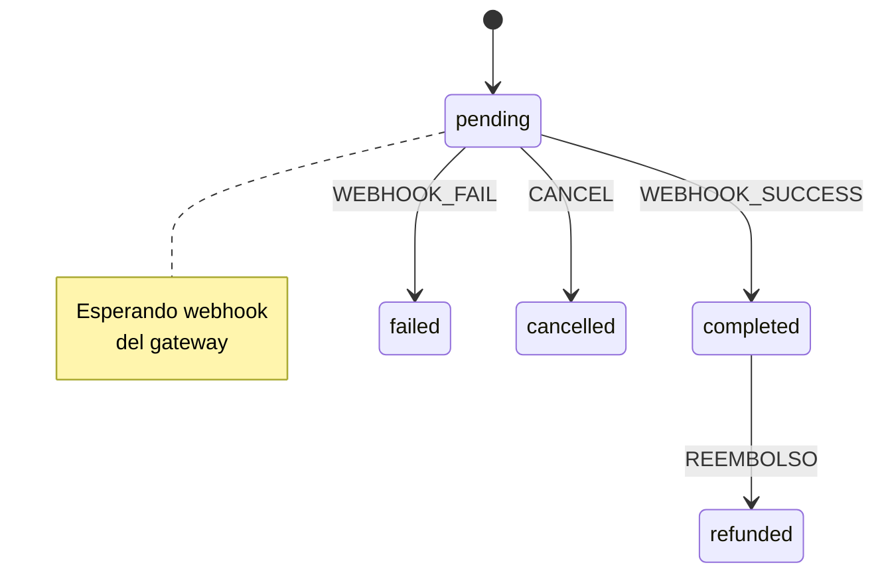
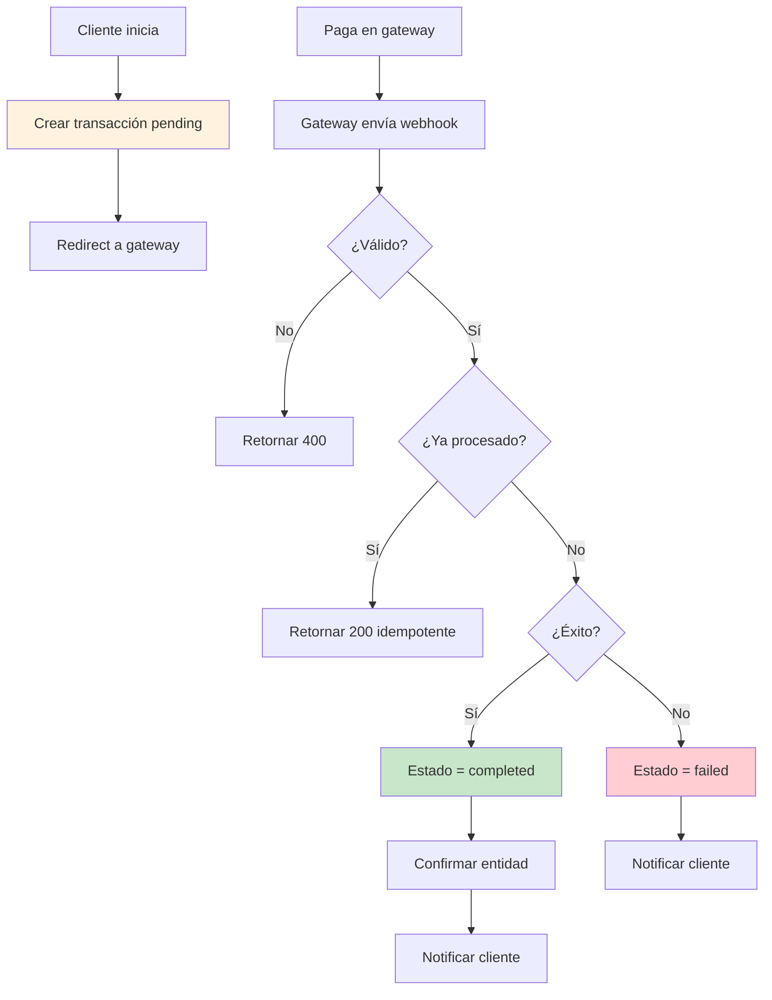

# Módulo Pagos - Documentación Técnica y Operativa

```
Version: 1.0
Fecha: 2026-02-19
Responsable: Jeans Selfene
Relacionado con: PLAN-TRABAJO-MTG v1.x
---
Historial de cambios:
| Versión | Fecha | Responsable | Cambios |
|---------|-------|-------------|---------|
| 1.0 | 2026-02-19 | Jeans Selfene | Versión inicial |
```

---

## A) MANUAL TÉCNICO

### 1. Propósito del Módulo

El módulo de Pagos maneja todas las transacciones financieras de la plataforma MTG, incluyendo:
- Pagos de reservas (abonos)
- Depósitos de subastas
- Confirmaciones de compra
- Reembolsos

**Características:**
- Integración con gateway de pago (webhook)
- Sistema de idempotencia
- Registro de transacciones
- Reembolsos

### 2. Arquitectura Interna

#### Archivos Involucrados

| Archivo | Propósito |
|---------|-----------|
| [`app/api/webhooks/payment/route.ts`](app/api/webhooks/payment/route.ts) | Webhook de pago |
| [`app/api/reservations/route.ts`](app/api/reservations/route.ts) | Crear reserva |
| [`app/api/auctions/[id]/deposit/route.ts`](app/api/auctions/[id]/deposit/route.ts) | Depósito subasta |
| [`lib/db/payments.ts`](lib/db/payments.ts) | Queries de pagos |
| [`lib/db/reservations.ts`](lib/db/reservations.ts) | Reservas |
| [`lib/core/atomic-transactions.ts`](lib/core/atomic-transactions.ts) | Transacciones atómicas |

### 3. Tablas Relacionadas (Schema + Índices)

#### Tabla: `payment_transactions`

```sql
CREATE TABLE payment_transactions (
    id TEXT PRIMARY KEY,
    entity_type TEXT NOT NULL CHECK(entity_type IN ('reservation', 'auction_deposit', 'auction_winner')),
    entity_id TEXT NOT NULL,
    amount INTEGER NOT NULL,
    currency TEXT DEFAULT 'CLP',
    payment_method TEXT,
    payment_id TEXT,
    status TEXT DEFAULT 'pending' CHECK(status IN ('pending', 'completed', 'failed', 'refunded', 'cancelled')),
    idempotency_key TEXT UNIQUE,
    metadata TEXT,
    created_at TEXT DEFAULT CURRENT_TIMESTAMP,
    updated_at TEXT DEFAULT CURRENT_TIMESTAMP
);
```

#### Índices

```sql
CREATE INDEX idx_payment_transactions_entity ON payment_transactions(entity_type, entity_id);
CREATE INDEX idx_payment_transactions_status ON payment_transactions(status);
CREATE INDEX idx_payment_transactions_idempotency ON payment_transactions(idempotency_key);
CREATE INDEX idx_payment_transactions_payment_id ON payment_transactions(payment_id);
```

### 4. Flujo de Estados

**Estados de Transacción:**

| Estado | Descripción |
|--------|-------------|
| `pending` | Iniciada, esperando confirmación |
| `completed` | Pagado exitosamente |
| `failed` | Pago rechazado o fallido |
| `refunded` | Reembolsado |
| `cancelled` | Cancelado |



### 5. Guards y Reglas de Negocio

#### Regla: PAGO_IDEMPOTENCIA
```typescript
// Siempre verificar idempotencia
const existingPayment = await getPaymentByIdempotencyKey(key);
if (existingPayment?.status === 'completed') {
  return { success: true, idempotent: true };
}
```

#### Regla: PAGO_SOLO_ENTIDADES_VALIDAS
```typescript
// Solo procesar pagos de reservation o auction_deposit
const validEntities = ['reservation', 'auction_deposit'];
if (!validEntities.includes(payload.entity_type)) {
  throw new Error('Tipo de entidad inválido');
}
```

#### Regla: PAGO_MONTO_COINCIDE
```typescript
// Verificar que monto coincida
if (payload.amount !== expectedAmount) {
  throw new Error('Monto no coincide');
}
```

### 6. Endpoints

| Método | Endpoint | Descripción |
|--------|----------|-------------|
| POST | `/api/webhooks/payment` | Webhook del gateway |
| POST | `/api/reservations` | Crear reserva (init payment) |
| POST | `/api/auctions/[id]/deposit` | Pagar depósito |

### 7. Dependencias

- **Gateway de pago**: Proveedor externo
- **D1 Database**: Registro de transacciones
- **lib/db/payments.ts**: Queries
- **lib/core/atomic-transactions.ts**: Consistencia

### 8. Riesgos

| Riesgo | Impacto | Mitigación |
|--------|---------|-------------|
| Webhook duplicado | Doble cargo | Idempotencia obligatoria |
| Webhook spoofing | Pago falso | Validar firma |
| Race condition | Estado inconsistente | Transacciones atómicas |

---

## B) MANUAL OPERATIVO

### 1. ¿Qué hace el Módulo?

- **Recibe notificaciones** de pago del gateway
- **Confirma reservas** cuando llega webhook de éxito
- **Cancela reservas** cuando llega webhook de fallo
- **Procesa reembolsos** cuando se solicita
- **Registra todo** en tabla de transacciones

### 2. Flujo

```
1. Cliente inicia reserva/depósito
2. Sistema crea transacción en estado "pending"
3. Cliente paga en gateway
4. Gateway envía webhook
5. Sistema valida:
   - Idempotency key
   - Firma del webhook
   - Monto
6. Sistema actualiza estado:
   - Success → "completed"
   - Fail → "failed"
7. Sistema actualiza entidad relacionada
```

### 3. Permisos

| Acción | Admin | Sales | Ops |
|--------|-------|-------|-----|
| Ver transacciones | ✅ | ✅ | ❌ |
| Reembolsar | ✅ | ❌ | ❌ |
| Cancelar | ✅ | ❌ | ❌ |

### 4. Escenarios

| Escenario | Acción |
|-----------|--------|
| Pago exitoso | Actualizar a completed, confirmar reserva |
| Pago fallido | Actualizar a failed, notificar cliente |
| Webhook duplicado | Ignorar (retornar 200) |
| Reembolso | Cambiar a refunded |

### 5. Error Handling

- **Webhook inválido**: Retornar 400, no reintentar
- **Error de DB**: Retornar 500, gateway reintenta
- **Idempotencia**: Retornar 200 OK

### 6. KPIs

| KPI | Meta |
|-----|------|
| PAY-01 Tasa de éxito | >95% |
| PAY-02 Tiempo confirmación | <5 min |
| PAY-03 Reembolsos | <5% |

---

## C) DIAGRAMA

### Flujo de Pago



### Arquitectura

```mermaid
graph TB
    Gateway[Payment Gateway]
    Webhook[/api/webhooks/payment]
    Idemp[Idempotency Check]
    Validate[Validate Payload]
    Entity[Update Entity]
    D1[(D1: transactions)]
    
    Gateway --> Webhook
    Webhook --> Idemp
    Idemp --> Validate
    Validate --> Entity
    Entity --> D1
```
