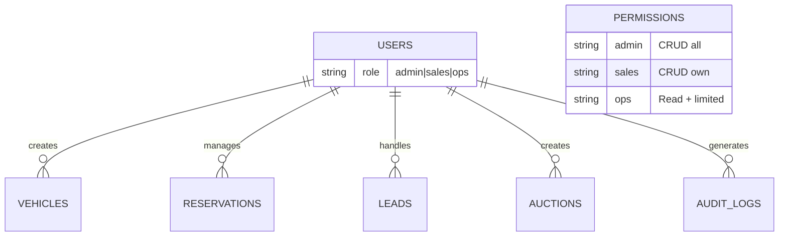

# Módulo Seguridad - Documentación Técnica y Operativa

```
Version: 1.0
Fecha: 2026-02-19
Responsable: Jeans Selfene
Relacionado con: PLAN-TRABAJO-MTG v1.x
---
Historial de cambios:
| Versión | Fecha | Responsable | Cambios |
|---------|-------|-------------|---------|
| 1.0 | 2026-02-19 | Jeans Selfene | Versión inicial |
```

---

## A) MANUAL TÉCNICO

### 1. Propósito del Módulo

El módulo de Seguridad establece los mecanismos de protección de la plataforma MTG, incluyendo:
- Autenticación de usuarios
- Autorización basada en roles
- Protección de rutas
- Rate limiting
- Auditoría de acciones

### 2. Arquitectura de Seguridad

#### Archivos Involucrados

| Archivo | Propósito |
|---------|-----------|
| [`lib/auth/index.ts`](lib/auth/index.ts) | Funciones de autenticación |
| [`middleware.ts`](middleware.ts) | Middleware de Next.js |
| [`app/api/auth/login/route.ts`](app/api/auth/login/route.ts) | Endpoint login |
| [`app/api/auth/me/route.ts`](app/api/auth/me/route.ts) | Current user |
| [`lib/core/rate-limit.ts`](lib/core/rate-limit.ts) | Rate limiting |
| [`lib/core/audit.ts`](lib/core/audit.ts) | Sistema de auditoría |

### 3. Sistema de Autenticación

#### Tabla: `users`

```sql
CREATE TABLE users (
    id TEXT PRIMARY KEY,
    email TEXT UNIQUE NOT NULL,
    password_hash TEXT NOT NULL,
    name TEXT,
    role TEXT DEFAULT 'sales' CHECK(role IN ('admin', 'sales', 'ops')),
    created_at TEXT DEFAULT CURRENT_TIMESTAMP,
    updated_at TEXT DEFAULT CURRENT_TIMESTAMP
);
```

#### Flujo de Autenticación

```typescript
// 1. Hash de contraseña
export async function hashPassword(password: string): Promise<string> {
  const salt = crypto.randomUUID();
  const hash = await crypto.subtle.digest('SHA-256', password + salt);
  return `${salt}:${hash}`;
}

// 2. Verificación
export async function verifyPassword(password: string, hash: string): boolean {
  const [salt, storedHash] = hash.split(':');
  const computed = await crypto.subtle.digest('SHA-256', password + salt);
  return computed === storedHash;
}

// 3. Token JWT
export function createToken(user: AuthUser): string {
  const payload = { userId, email, role, exp: now + 7d };
  return base64(JSON.stringify(payload));
}
```

### 4. Sistema de Roles

| Rol | Descripción | Permisos |
|-----|-------------|----------|
| `admin` | Administrador | Acceso total |
| `sales` | Vendedor | Gestión operativa |
| `ops` | Operativo | Solo operación básica |

**Matriz de Permisos:**

| Recurso | Admin | Sales | Ops |
|---------|-------|-------|-----|
| Vehicles CRUD | ✅ | ✅ | Read |
| Publish vehicle | ✅ | ✅ | ❌ |
| Reservas | ✅ | ✅ | Read |
| Leads | ✅ | ✅* | ❌ |
| Consignaciones | ✅ | ✅ | ❌ |
| Subastas | ✅ | Create | ❌ |
| Usuarios | ✅ | ❌ | ❌ |
| Settings | ✅ | ❌ | ❌ |

*Solo sus leads asignados

### 5. Middleware de Protección

```typescript
// middleware.ts
export function middleware(request: NextRequest) {
  const token = request.cookies.get('mtg_session');
  
  // Rutas públicas
  if (isPublicRoute(request.nextUrl.pathname)) {
    return NextResponse.next();
  }
  
  // Rutas de autenticación
  if (isAuthRoute(request.nextUrl.pathname)) {
    if (token) {
      return NextResponse.redirect(new URL('/admin', request.url));
    }
    return NextResponse.next();
  }
  
  // Rutas protegidas
  if (!token) {
    return NextResponse.redirect(new URL('/admin/login', request.url));
  }
  
  // Verificar rol para rutas admin
  if (request.nextUrl.pathname.startsWith('/admin')) {
    const user = verifyToken(token.value);
    if (!user) {
      return NextResponse.redirect(new URL('/admin/login', request.url));
    }
  }
  
  return NextResponse.next();
}
```

### 6. Rate Limiting

#### Tabla: `rate_limits`

```sql
CREATE TABLE rate_limits (
    key TEXT PRIMARY KEY,
    count INTEGER DEFAULT 0,
    reset_at TEXT NOT NULL
);
```

#### Reglas de Rate Limit

| Endpoint | Límite | Ventana |
|----------|--------|---------|
| `/api/auth/login` | 5 | 15 min |
| `/api/reservations` | 10 | 1 hour |
| `/api/leads` | 20 | 1 hour |
| `/api/auctions/[id]/bid` | 30 | 1 hour |

### 7. Sistema de Auditoría

#### Tabla: `audit_logs`

```sql
CREATE TABLE audit_logs (
    id TEXT PRIMARY KEY,
    user_id TEXT REFERENCES users(id),
    entity_type TEXT NOT NULL,
    entity_id TEXT NOT NULL,
    action TEXT NOT NULL,
    old_value TEXT,
    new_value TEXT,
    created_at TEXT DEFAULT CURRENT_TIMESTAMP
);
```

#### Acciones Auditadas

- `created` - Creación de entidad
- `updated` - Modificación
- `deleted` - Eliminación
- `status_changed` - Cambio de estado
- `login` - Inicio de sesión
- `logout` - Cierre de sesión

### 8. Reglas de Seguridad

#### Regla: PASSWORDS_SEGUROS
```typescript
// Mínimo 8 caracteres, al menos una mayúscula y un número
const isValidPassword = (pwd) => /^(?=.*[A-Z])(?=.*\d).{8,}$/.test(pwd);
```

#### Regla: ADMIN_ONLY_ARCHIVE
```typescript
// Solo admin puede archivar vehículos
const canArchive = (user, vehicle) => {
  if (user.role !== 'admin') return false;
  return true;
};
```

#### Regla: SUBASTA_BLOQUEA_RESERVA
```typescript
// Si hay subasta activa, bloquear reservas
const canReserve = async (vehicleId) => {
  const auction = await getActiveAuction(vehicleId);
  return !auction;
};
```

---

## B) MANUAL OPERATIVO

### 1. ¿Qué hace el Módulo?

- **Autentica** usuarios admin
- **Autoriza** acciones según rol
- **Limita** requests excesivos
- **Registra** todas las acciones sensibles
- **Protege** rutas y endpoints

### 2. Flujo de Login

```
1. Usuario va a /admin/login
2. Ingresa email y contraseña
3. Sistema verifica credenciales
4. Sistema crea token JWT
5. Sistema guarda en cookie
6. Redirect a /admin
```

### 3. Gestión de Usuarios (Admin)

| Acción | Descripción |
|--------|-------------|
| Crear usuario | Solo admin puede crear |
| Editar usuario | Admin o propio perfil |
| Cambiar rol | Solo admin |
| Eliminar usuario | Solo admin |

### 4. Contraseñas

- Mínimo 8 caracteres
- Al menos 1 mayúscula
- Al menos 1 número
- Hash con salt aleatorio
- NO almacenar en texto plano

### 5. ¿Qué auditar?

| Acción | Registro |
|--------|----------|
| Login exitoso | ✅ IP, timestamp |
| Login fallido | ✅ IP, intentos |
| Crear vehículo | ✅ Usuario, datos |
| Cambiar estado | ✅ Anterior → Nuevo |
| Eliminar | ✅ Usuario, entidad |

### 6. Escenarios de Error

| Error | Causa | Solución |
|-------|-------|----------|
| Login falla | Contraseña incorrecta | Reintentar, verificar caps |
| Acceso denegado | Sin permisos | Contactar admin |
| Token expira | Sesión vencida | Login de nuevo |
| Rate limited | Demasiados requests | Esperar ventana |

### 7. KPIs

| KPI | Meta |
|-----|------|
| SEC-01 Login exitosos | >95% |
| SEC-02 Intentos fallidos | <5% |
| SEC-03 Acciones auditadas | 100% |
| SEC-04 Rate limit triggers | <1% |

---

## C) DIAGRAMA

### Flujo de Autenticación

```mermaid
flowchart TD
    A[Usuario] --> B[/admin/login]
    B --> C[Formulario]
    C --> D[POST /api/auth/login]
    D --> E{¿Credenciales válidas?}
    E -->|No| F[Retornar error]
    F --> G[Mostrar mensaje]
    G --> C
    
    E -->|Sí| H[Crear JWT token]
    H --> I[Guardar en cookie]
    I --> J[Redirect /admin]
    J --> K[Acceso concedido]
    
    style H fill:#c8e6c9
    style F fill:#ffcdd2
```

### Arquitectura de Seguridad

```mermaid
graph TB
    subgraph Cliente
        Browser[Browser]
    end
    
    subgraph Middleware
        MW[Next.js Middleware]
    end
    
    subgraph Auth
        Login[/api/auth/login]
        Verify[Verify Token]
    end
    
    subgraph Protection
        Roles[Role Check]
        Rate[Rate Limiter]
        Audit[Audit Logger]
    end
    
    subgraph Data
        D1[(D1: users)]
    end
    
    Browser --> MW
    MW --> Login
    MW --> Verify
    Verify --> Roles
    Roles --> Rate
    Rate --> Audit
    Audit --> D1
    
    style MW fill:#e1f5fe
    style Roles fill:#fff3e0
    style Audit fill:#ffecb3
```

### Matriz de Permisos


