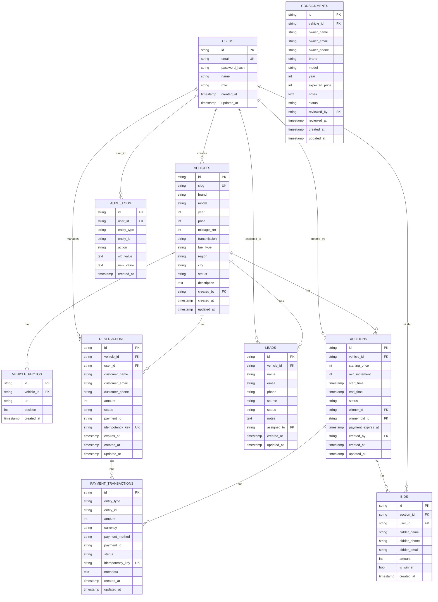

# Módulo Base de Datos - Documentación Técnica y Operativa

```
Version: 1.0
Fecha: 2026-02-19
Responsable: Jeans Selfene
Relacionado con: PLAN-TRABAJO-MTG v1.x
---
Historial de cambios:
| Versión | Fecha | Responsable | Cambios |
|---------|-------|-------------|---------|
| 1.0 | 2026-02-19 | Jeans Selfene | Versión inicial |
```

---

## A) MANUAL TÉCNICO

### 1. Propósito del Módulo

El módulo de Base de Datos documenta el esquema completo de D1 utilizado por la plataforma MTG. Este documento sirve como fuente de verdad para la estructura de datos y sus relaciones.

### 2. Arquitectura de Datos

#### Tecnologías

- **D1 Database**: Base de datos SQLite de Cloudflare
- **R2 Storage**: Almacenamiento de objetos para imágenes
- **Índices**: Optimización de consultas frecuentes

### 3. Esquema Completo

#### 3.1 Tabla: `users`

```sql
CREATE TABLE users (
    id TEXT PRIMARY KEY,
    email TEXT UNIQUE NOT NULL,
    password_hash TEXT NOT NULL,
    name TEXT,
    role TEXT DEFAULT 'sales' CHECK(role IN ('admin', 'sales', 'ops')),
    created_at TEXT DEFAULT CURRENT_TIMESTAMP,
    updated_at TEXT DEFAULT CURRENT_TIMESTAMP
);

-- Índices
CREATE INDEX idx_users_email ON users(email);
CREATE INDEX idx_users_role ON users(role);
```

**Descripción:** Usuarios del sistema administrativo.

| Campo | Tipo | Requerido | Descripción |
|-------|------|-----------|-------------|
| id | TEXT | ✅ | UUID único |
| email | TEXT | ✅ | Email único |
| password_hash | TEXT | ✅ | Hash de contraseña |
| name | TEXT | ❌ | Nombre display |
| role | TEXT | ✅ | Rol del usuario |
| created_at | TEXT | ✅ | Timestamp creación |
| updated_at | TEXT | ✅ | Timestamp actualización |

---

#### 3.2 Tabla: `vehicles`

```sql
CREATE TABLE vehicles (
    id TEXT PRIMARY KEY,
    slug TEXT UNIQUE NOT NULL,
    brand TEXT NOT NULL,
    model TEXT NOT NULL,
    year INTEGER NOT NULL,
    price INTEGER NOT NULL,
    mileage_km INTEGER,
    transmission TEXT CHECK(transmission IN ('manual', 'auto')),
    fuel_type TEXT,
    region TEXT,
    city TEXT,
    status TEXT DEFAULT 'draft' CHECK(status IN ('draft', 'published', 'reserved', 'sold', 'hidden', 'archived')),
    description TEXT,
    created_by TEXT REFERENCES users(id),
    created_at TEXT DEFAULT CURRENT_TIMESTAMP,
    updated_at TEXT DEFAULT CURRENT_TIMESTAMP
);

-- Índices
CREATE INDEX idx_vehicles_status ON vehicles(status);
CREATE INDEX idx_vehicles_created_at ON vehicles(created_at);
CREATE INDEX idx_vehicles_brand_model ON vehicles(brand, model);
CREATE INDEX idx_vehicles_slug ON vehicles(slug);
CREATE INDEX idx_vehicles_price ON vehicles(price);
```

**Descripción:** Inventario de vehículos.

---

#### 3.3 Tabla: `vehicle_photos`

```sql
CREATE TABLE vehicle_photos (
    id TEXT PRIMARY KEY,
    vehicle_id TEXT NOT NULL REFERENCES vehicles(id) ON DELETE CASCADE,
    url TEXT NOT NULL,
    position INTEGER DEFAULT 0,
    created_at TEXT DEFAULT CURRENT_TIMESTAMP
);

CREATE INDEX idx_vehicle_photos_vehicle_id ON vehicle_photos(vehicle_id);
```

**Descripción:** Fotos de vehículos almacenadas en R2.

---

#### 3.4 Tabla: `reservations`

```sql
CREATE TABLE reservations (
    id TEXT PRIMARY KEY,
    vehicle_id TEXT NOT NULL REFERENCES vehicles(id),
    user_id TEXT REFERENCES users(id),
    customer_name TEXT,
    customer_email TEXT,
    customer_phone TEXT,
    amount INTEGER NOT NULL,
    status TEXT DEFAULT 'pending_payment' CHECK(status IN ('pending_payment', 'paid', 'confirmed', 'expired', 'cancelled', 'refunded')),
    payment_id TEXT,
    idempotency_key TEXT UNIQUE,
    expires_at TEXT NOT NULL,
    created_at TEXT DEFAULT CURRENT_TIMESTAMP,
    updated_at TEXT DEFAULT CURRENT_TIMESTAMP
);

CREATE INDEX idx_reservations_vehicle_id ON reservations(vehicle_id);
CREATE INDEX idx_reservations_status ON reservations(status);
CREATE INDEX idx_reservations_created_at ON reservations(created_at);
CREATE INDEX idx_reservations_expires ON reservations(expires_at);
```

**Descripción:** Reservas con abono de vehículos.

---

#### 3.5 Tabla: `leads`

```sql
CREATE TABLE leads (
    id TEXT PRIMARY KEY,
    vehicle_id TEXT REFERENCES vehicles(id),
    name TEXT NOT NULL,
    email TEXT,
    phone TEXT NOT NULL,
    source TEXT,
    status TEXT DEFAULT 'new' CHECK(status IN ('new', 'contacted', 'scheduled', 'closed_won', 'closed_lost')),
    notes TEXT,
    assigned_to TEXT REFERENCES users(id),
    created_at TEXT DEFAULT CURRENT_TIMESTAMP,
    updated_at TEXT DEFAULT CURRENT_TIMESTAMP
);

CREATE INDEX idx_leads_vehicle_id ON leads(vehicle_id);
CREATE INDEX idx_leads_status ON leads(status);
CREATE INDEX idx_leads_assigned_to ON leads(assigned_to);
```

**Descripción:** Contactos potenciales y pipeline de ventas.

---

#### 3.6 Tabla: `consignments`

```sql
CREATE TABLE consignments (
    id TEXT PRIMARY KEY,
    vehicle_id TEXT NULL REFERENCES vehicles(id),
    owner_name TEXT NOT NULL,
    owner_email TEXT NULL,
    owner_phone TEXT NOT NULL,
    brand TEXT NOT NULL,
    model TEXT NOT NULL,
    year INTEGER NOT NULL,
    expected_price INTEGER NULL,
    notes TEXT NULL,
    status TEXT DEFAULT 'received' CHECK(status IN ('received', 'under_review', 'approved', 'rejected', 'published')),
    reviewed_by TEXT NULL REFERENCES users(id),
    reviewed_at TEXT NULL,
    created_at TEXT DEFAULT CURRENT_TIMESTAMP,
    updated_at TEXT DEFAULT CURRENT_TIMESTAMP
);

CREATE INDEX idx_consignments_status ON consignments(status);
CREATE INDEX idx_consignments_created_at ON consignments(created_at);
CREATE INDEX idx_consignments_reviewed_at ON consignments(reviewed_at);
```

**Descripción:** Consignaciones de vehículos de clientes.

---

#### 3.7 Tabla: `consignment_photos`

```sql
CREATE TABLE consignment_photos (
    id TEXT PRIMARY KEY,
    consignment_id TEXT NOT NULL REFERENCES consignments(id) ON DELETE CASCADE,
    url TEXT NOT NULL,
    position INTEGER DEFAULT 0,
    created_at TEXT DEFAULT CURRENT_TIMESTAMP
);

CREATE INDEX idx_consignment_photos_consignment_id ON consignment_photos(consignment_id);
```

---

#### 3.8 Tabla: `auctions`

```sql
CREATE TABLE auctions (
    id TEXT PRIMARY KEY,
    vehicle_id TEXT NOT NULL REFERENCES vehicles(id),
    starting_price INTEGER NOT NULL,
    min_increment INTEGER DEFAULT 10000,
    start_time TEXT NOT NULL,
    end_time TEXT NOT NULL,
    status TEXT DEFAULT 'scheduled' CHECK(status IN ('scheduled', 'active', 'ended_pending_payment', 'closed_won', 'closed_failed', 'cancelled', 'expired', 'ended_no_bids')),
    winner_id TEXT NULL,
    winner_bid_id TEXT NULL,
    payment_expires_at TEXT NULL,
    created_by TEXT NULL REFERENCES users(id),
    created_at TEXT DEFAULT CURRENT_TIMESTAMP,
    updated_at TEXT DEFAULT CURRENT_TIMESTAMP
);

CREATE INDEX idx_auctions_vehicle_id ON auctions(vehicle_id);
CREATE INDEX idx_auctions_status ON auctions(status);
CREATE INDEX idx_auctions_end_time ON auctions(end_time);
```

**Descripción:** Subastas de vehículos.

---

#### 3.9 Tabla: `bids`

```sql
CREATE TABLE bids (
    id TEXT PRIMARY KEY,
    auction_id TEXT NOT NULL REFERENCES auctions(id),
    user_id TEXT NULL,
    bidder_name TEXT NOT NULL,
    bidder_phone TEXT NOT NULL,
    bidder_email TEXT NULL,
    amount INTEGER NOT NULL,
    is_winner INTEGER DEFAULT 0,
    created_at TEXT DEFAULT CURRENT_TIMESTAMP
);

CREATE INDEX idx_bids_auction_id ON bids(auction_id);
CREATE INDEX idx_bids_amount ON bids(amount DESC);
```

**Descripción:** Pujas en subastas.

---

#### 3.10 Tabla: `payment_transactions`

```sql
CREATE TABLE payment_transactions (
    id TEXT PRIMARY KEY,
    entity_type TEXT NOT NULL CHECK(entity_type IN ('reservation', 'auction_deposit', 'auction_winner')),
    entity_id TEXT NOT NULL,
    amount INTEGER NOT NULL,
    currency TEXT DEFAULT 'CLP',
    payment_method TEXT,
    payment_id TEXT,
    status TEXT DEFAULT 'pending' CHECK(status IN ('pending', 'completed', 'failed', 'refunded', 'cancelled')),
    idempotency_key TEXT UNIQUE,
    metadata TEXT,
    created_at TEXT DEFAULT CURRENT_TIMESTAMP,
    updated_at TEXT DEFAULT CURRENT_TIMESTAMP
);

CREATE INDEX idx_payment_transactions_entity ON payment_transactions(entity_type, entity_id);
CREATE INDEX idx_payment_transactions_status ON payment_transactions(status);
CREATE INDEX idx_payment_transactions_idempotency ON payment_transactions(idempotency_key);
```

**Descripción:** Registro de transacciones de pago.

---

#### 3.11 Tabla: `documents`

```sql
CREATE TABLE documents (
    id TEXT PRIMARY KEY,
    vehicle_id TEXT NOT NULL REFERENCES vehicles(id) ON DELETE CASCADE,
    type TEXT CHECK(type IN ('contract', 'checklist', 'inspection', 'registration', 'other')),
    url TEXT,
    uploaded_by TEXT REFERENCES users(id),
    created_at TEXT DEFAULT CURRENT_TIMESTAMP
);

CREATE INDEX idx_documents_vehicle_id ON documents(vehicle_id);
```

**Descripción:** Documentos asociados a vehículos.

---

#### 3.12 Tabla: `audit_logs`

```sql
CREATE TABLE audit_logs (
    id TEXT PRIMARY KEY,
    user_id TEXT REFERENCES users(id),
    entity_type TEXT NOT NULL,
    entity_id TEXT NOT NULL,
    action TEXT NOT NULL CHECK(action IN ('created', 'updated', 'deleted', 'status_changed')),
    old_value TEXT,
    new_value TEXT,
    created_at TEXT DEFAULT CURRENT_TIMESTAMP
);

CREATE INDEX idx_audit_logs_entity ON audit_logs(entity_type, entity_id);
CREATE INDEX idx_audit_logs_user ON audit_logs(user_id);
```

**Descripción:** Registro de auditoría.

---

#### 3.13 Tabla: `rate_limits`

```sql
CREATE TABLE rate_limits (
    key TEXT PRIMARY KEY,
    count INTEGER DEFAULT 0,
    reset_at TEXT NOT NULL
);
```

**Descripción:** Rate limiting para APIs.

---

### 4. Relaciones entre Tablas


### 5. Índices por Rendimiento

| Tabla | Índice | Propósito |
|-------|--------|-----------|
| vehicles | idx_vehicles_status | Filtrar por estado |
| vehicles | idx_vehicles_brand_model | Filtros combinados |
| vehicles | idx_vehicles_price | Ordenar por precio |
| reservations | idx_reservations_vehicle | Lookup por vehículo |
| reservations | idx_reservations_status | Filtrar estado |
| reservations | idx_reservations_expires | Cron expiraciones |
| leads | idx_leads_status | Pipeline |
| leads | idx_leads_assigned_to | Mis leads |
| auctions | idx_auctions_status | Subastas activas |
| auctions | idx_auctions_end_time | Cron cierre |
| bids | idx_bids_amount DESC | Mayor puja |
| payment | idx_payment_transactions_idempotency | Evitar duplicados |

### 6. Migraciones

| Archivo | Versión | Descripción |
|---------|---------|-------------|
| 0001_init.sql | 0001 | Tablas base MVP |
| 0002_add_consignments.sql | 0002 | Módulo consignaciones |
| 0003_add_payment_transactions.sql | 0003 | Transacciones de pago |
| 0004_add_auctions.sql | 0004 | Módulo subastas |
| 0005_add_auction_deposit_fields.sql | 0005 | Campos depósito |
| 0006_add_rate_limits.sql | 0006 | Rate limiting |
| 0007_add_rate_limit_ttl.sql | 0007 | TTL rate limits |
| 0008_add_raffles.sql | 0008 | Módulo rifas |
| 0009_seed_admin_user.sql | 0009 | Usuario admin inicial |

---

## B) MANUAL OPERATIVO

### 1. ¿Qué hace el Módulo?

El módulo de Base de Datos proporciona:
- **Almacenamiento** persistente de todas las entidades
- **Relaciones** entre módulos
- **Índices** para rendimiento
- **Auditoría** de cambios

### 2. Entidades Principales

| Entidad | Descripción | Módulo |
|---------|-------------|--------|
| users | Administradores | Seguridad |
| vehicles | Inventario | Vehículos |
| reservations | Reservas | Reservas |
| leads | Contactos | Leads |
| consignments | Consignaciones | Consignación |
| auctions | Subastas | Subastas |
| bids | Pujas | Subastas |
| payments | Transacciones | Pagos |

### 3. Estados por Entidad

| Entidad | Estados |
|---------|---------|
| vehicles | draft, published, hidden, reserved, sold, archived |
| reservations | pending_payment, paid, confirmed, expired, cancelled, refunded |
| leads | new, contacted, scheduled, closed_won, closed_lost |
| consignments | received, under_review, approved, rejected, published |
| auctions | scheduled, active, ended_pending_payment, closed_won, closed_failed, cancelled |
| payments | pending, completed, failed, refunded, cancelled |

### 4. Reglas de Integridad

- **Eliminación en cascada**: Photos se eliminan con vehicle
- **Foreign keys**: Todos los IDs referenciados existen
- **Checks**: Estados válidos definidos en SQL
- **Uniques**: Email usuario, slug vehículo, idempotency key

### 5. Consultas Comunes

```sql
-- Vehículos publicados
SELECT * FROM vehicles WHERE status = 'published';

-- Reservas activas
SELECT * FROM reservations WHERE status IN ('pending_payment', 'paid', 'confirmed');

-- Subastas activas
SELECT * FROM auctions WHERE status = 'active' AND end_time > datetime('now');

-- Leads por estado
SELECT status, COUNT(*) FROM leads GROUP BY status;
```

### 6. ¿Qué hacer si hay problemas?

| Problema | Solución |
|----------|----------|
| Query lenta | Agregar índice |
| Datos inconsistentes | Revisar transacciones |
| Error de clave foránea | Verificar registros relacionados |
| Migration falla | Revisar sintaxis SQL |

---

## C) DIAGRAMA

### Diagrama ER Completo



### Flujo de Datos


